<br><br>

```{r setup, include=FALSE}
WD="~/OneDrive - The University of Queensland/mater_projs/auti_proj/AutismSpeaks_SSC/"
knitr::opts_knit$set(root.dir = WD)

knitr::opts_chunk$set(echo = TRUE)
```

# Probands  {.tabset .tabset-fade .tabset-pills}
- Note that the measurement of sum and mean is similar, thus only sum is presented.
- 13 Primary Variables
- 12 Secondary Variables
- Adjusted by **Age, Sex, Chip, FSIQ (with or without)** and then rank-based invserse normalise transformed (RINT).
```{r read_Variables, include=FALSE}
phe <- read.table("../outputs/Probands_Key_Variables_matchedID_cleaned.txt", header = T, stringsAsFactors = F)
summs <- read.table("../outputs/phenotype_variable_summary.txt", header = T, stringsAsFactors = F)
load("../outputs/phe_adj_probands.Rdata")

fams <- read.table("../outputs/fams_covarites.txt", stringsAsFactors = F)
names(fams)[c(1:2, 7)] <- c("FID", "IID", "chip")

load("../outputs/summary_phenotypes.Rdata")
mu <- mus[[1]]
mu2 <- mus[[2]]

load("../outputs/phe_adj_unaffSibs.Rdata")

phe_unaff <- read.table("../outputs/Unaffected_Siblings_matchedID_cleaned.txt", header = T, stringsAsFactors = F)
pcs <- read.table("../outputs/SSC_imputed_autosome_info.3_pruned.3_pca20.eigenvec", stringsAsFactors = F)
names(pcs) <- c("FID", "IID", paste0("PC", 1:20))
```

```{r adj_phe, eval=FALSE, include=FALSE}
#phe_cov <- phe_m2[,c("FID", "IID", "Age",  "FSIQ", paste0("PC", 1:20))]
#write.table(phe_cov, file = "~/cnsg/auti/SSC/phenotypes/RRBs/qcov_probands.txt", col.names = F, row.names = F, quote = F, sep = "\t")

#phe_cov2 <- phe_m2[,c("FID", "IID", "Age",  paste0("PC", 1:20))]
#write.table(phe_cov2, file = "~/cnsg/auti/SSC/phenotypes/RRBs/qcov_probands_withoutIQ.txt", col.names = F, row.names = F, quote = F, sep = "\t")

# names(pcs) <- c("FID", "IID", paste0("PC", 1:20))
# pcs$Age <- "NA"
# pcs[pcs$IID %in% phe$IID, "Age"] <- phe[match(pcs[pcs$IID %in% phe$IID, "IID"], phe$IID), "Age"]
# pcs$FSIQ <- "NA"
# pcs[pcs$IID %in% phe$IID, "FSIQ"] <- phe[match(pcs[pcs$IID %in% phe$IID, "IID"], phe$IID), "FSIQ"]
# write.table(pcs, file = "~/cnsg/auti/SSC/phenotypes/RRBs/qcov_probSibs.txt", col.names = F, row.names = F, quote = F, sep = "\t")
# write.table(pcs[1:23], file = "~/cnsg/auti/SSC/phenotypes/RRBs/qcov_probSibs_WithoutIQ.txt", col.names = F, row.names = F, quote = F, sep = "\t")

phe_m1 <- merge(x = phe, y = fams, id = c("FID", "IID"), all.x = T )
phe_m2 <- merge(x = phe_m1, y = pcs, id = c("FID", "IID"), all.x = T )

xnam <- paste("PC", 1:20, sep="")

phe_adj1 <- phe_adj2 <- phe_adj3 <- phe_adj4 <-phe_m2[,c("FID", "IID", "Age", "sex", "FSIQ", "chip")]

for(ncol in 10:ncol(phe)){
  y <- colnames(phe)[ncol]
  dat <- phe_m2[,c(y, "Age", "sex", "FSIQ", "chip", paste0("PC", 1:20))]
  names(dat)[1] <- "Y"

  ##adjust IQ 
  phe_resids <- resid(lm(Y ~ Age + sex + FSIQ + chip, data = dat, na.action=na.exclude))
  Tmp <- data.frame(phe_m2[,c("FID", "IID", "sex")], phe_resids)
  for(j in levels(factor(Tmp$sex))){
    Tmp[Tmp$sex == i, "phe_resids"]<- qnorm((rank(Tmp[Tmp$sex == i,]$phe_resids,na.last="keep") - 0.5)/sum(!is.na(Tmp[Tmp$sex == i,]$phe_resids))) 
  }
  phe_rint <- Tmp[match(phe_adj1$IID, Tmp$IID), "phe_resids"]
  phe_adj1[,(ncol-3)] <- phe_rint
  names(phe_adj1)[(ncol-3)] <- y
  
  ##Without adjust IQ
  phe_resid2 <- resid(lm(Y ~ Age + sex + chip, data = dat, na.action=na.exclude))
  Tmp2 <- data.frame(phe_m2[,c("FID", "IID", "sex")], phe_resid2)
  for(j in levels(factor(Tmp2$sex))){
    Tmp2[Tmp2$sex == i, "phe_resid2"]<- qnorm((rank(Tmp2[Tmp2$sex == i,]$phe_resid2,na.last="keep") - 0.5)/sum(!is.na(Tmp2[Tmp2$sex == i,]$phe_resid2))) 
  }
  phe_rint <- Tmp2[match(phe_adj2$IID, Tmp2$IID), "phe_resid2"]
  phe_adj2[,(ncol-3)] <- phe_rint
  names(phe_adj2)[(ncol-3)] <- y
  
  ##adjust IQ and PCs
  fmla <- as.formula(paste("Y ~ Age + FSIQ + chip + ", paste(xnam, collapse= "+") ))
  phe_resid3 <- resid(lm(fmla, data = dat, na.action=na.exclude))
  ##RINT within sex
  tmp3 <- data.frame(phe_m2[,c("FID", "IID", "sex")], phe_resid3)
  for(i in levels(factor(tmp3$sex))){
      tmp3[tmp3$sex == i, "phe_resid3"]<- qnorm((rank(tmp3[tmp3$sex == i,]$phe_resid3,na.last="keep") - 0.5)/sum(!is.na(tmp3[tmp3$sex == i,]$phe_resid3))) 
  }
  phe_rint3 <- tmp3[match(phe_adj3$IID, tmp3$IID), "phe_resid3"]
  phe_adj3[,(ncol-3)] <- phe_rint3
  names(phe_adj3)[(ncol-3)] <- y
  
  ##adjust PCs but without IQ
  fmla2 <- as.formula(paste("Y ~ Age +  chip + ", paste(xnam, collapse= "+") ))
  phe_resid4 <- resid(lm(fmla2, data = dat, na.action=na.exclude))
  ##RINT within sex
  tmp4 <- data.frame(phe_m2[,c("FID", "IID", "sex")], phe_resid4)
  for(i in levels(factor(tmp4$sex))){
    tmp4[tmp4$sex == i, "phe_resid4"]<- qnorm((rank(tmp4[tmp4$sex == i,]$phe_resid4,na.last="keep") - 0.5)/sum(!is.na(tmp4[tmp4$sex == i,]$phe_resid4))) 
  }
  phe_rint4 <- tmp4[match(phe_adj4$IID, tmp4$IID), "phe_resid4"]
  phe_adj4[,(ncol-4)] <- phe_rint4
  names(phe_adj4)[(ncol-4)] <- y
}
phe_adj <- list(phe_adj1, phe_adj2)
save(phe_adj, file = "../outputs/phe_adj_probands.Rdata")
save(phe_adj, file = "~/rcc/autism_proj/SSC/output/phe_adj_probands.Rdata")

write.table(phe_adj1, file = "~/cnsg/auti/SSC/phenotypes/RRBs/phe_adjWithIQ_probands.txt", col.names = T, row.names = F, quote = F, sep = "\t")
write.table(phe_adj2, file = "~/cnsg/auti/SSC/phenotypes/RRBs/phe_adjWithoutIQ_probands.txt", col.names = T, row.names = F, quote = F, sep = "\t")
write.table(phe_adj3, file = "~/cnsg/auti/SSC/phenotypes/RRBs/phe_adjPCsWithIQ_probands.txt", col.names = T, row.names = F, quote = F, sep = "\t")
write.table(phe_adj4, file = "~/cnsg/auti/SSC/phenotypes/RRBs/phe_adjPCsWithoutIQ_probands.txt", col.names = T, row.names = F, quote = F, sep = "\t")
```

## Primary Variables {.tabset .tabset-fade .tabset-pills}
### Not Adjusted
```{r eval=FALSE, include=FALSE}
index_pri <- which(colnames(phe) %in% summs$Primary_Variable) ##26
pri_prob <- phe[,index_pri]
pri_prob$Adjust <- "Not adjusted"
pri_probII <- melt(pri_prob, id = "Adjust")
pri_probII <- pri_probII[grep("_sum", pri_probII$variable),]
muII <- mu[match(pri_probII$variable, mu$Variable),]
pri_probII$levels <- muII$Levels
pri_probII$Counts <- muII$Counts
pri_probII$Shared <- "Probands Only"
pri_probII[pri_probII$variable %in% colnames(phe_unaff), "Shared"] <- "Shared With Unaffected Siblings"

plot_pri_probII <- ggplot(pri_probII,aes(x = value, color = Shared, fill = Shared)) + 
  geom_histogram(alpha = 0.2) +
  geom_text( aes(label= paste0(Counts, " (", levels, ")"), x = 0, y = 250), hjust = -0.05 ) +
  facet_wrap(~variable,scales = "free", nrow = 3) +     

  theme_bw() +
  theme(
    text = element_text(size=14, face="bold"),
    axis.title.x = element_blank(),
    legend.position = c(0.8,0.1),
    legend.text = element_text(size = 16),
    legend.title = element_blank()
  ) +
  ylab("Frequency") 

ggsave(file.path("figures/primary_probands_Notadj.png"), plot_pri_probII, height = 10, width = 16, dpi = 300)
```

```{r plot_pri_probII, out.width="100%", out.height="100%", dpi=300}
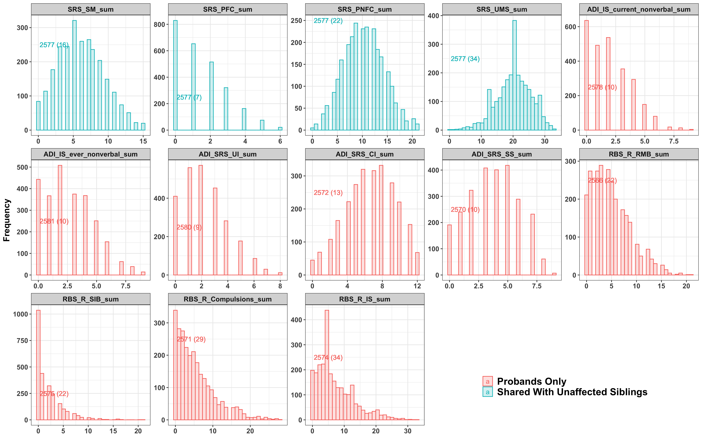
```

<br>

**Sample Sizes (Levels of phenotypes) are shown.**

***

<br>

### Adjusted {.tabset .tabset-fade .tabset-pills}
#### PCs Excluded
```{r eval=FALSE, warning=FALSE, include=FALSE}
index_pri <- which(colnames(phe_adj1) %in% summs$Primary_Variable) ##26
pri_prob1 <- phe_adj1[,index_pri]
pri_prob1$Adjust <- "IQ adjusted"
pri_prob2 <- phe_adj2[,index_pri]
pri_prob2$Adjust <- "IQ not adjusted"

pri_probs <- rbind(melt(pri_prob1, id = "Adjust"), melt(pri_prob2, id = "Adjust"))
pri_probs <- pri_probs[grep("sum", pri_probs$variable),]
plot_pri_probs <- ggplot(pri_probs,aes(x = value, color = Adjust, fill = Adjust)) + 
  facet_wrap(~variable,scales = "free", nrow = 3) + 
  geom_histogram(alpha = 0.2) +
  theme_bw() +
  theme(
    text = element_text(size=14, face="bold"),
    axis.title.x = element_blank(),
    legend.position = c(0.8,0.1),
    legend.text = element_text(size = 16),
    legend.title = element_blank()
  ) +
  ylab("Frequency") 
ggsave(file.path("figures/primary_probands_adj.png"), plot_pri_probs, height = 10, width = 16, dpi = 300)
```

```{r p_pri_probs, out.width="100%", out.height="100%", dpi=300}
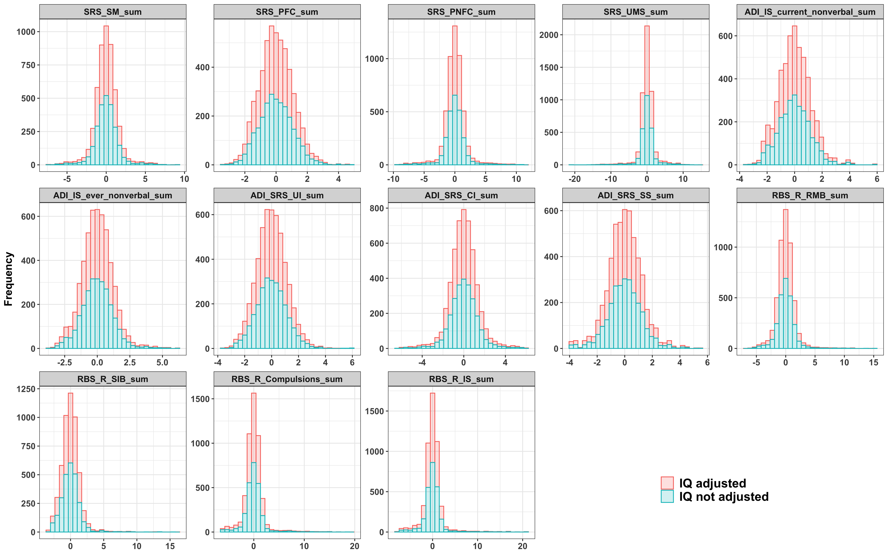
```

***

<br>

#### PCs Included
```{r eval=FALSE, warning=FALSE, include=FALSE}
library(ggplot2)

setwd("/afm01/UQ/Q3490/SSC/phenotypes")
phe_adj3 <- read.table("phe_adjPCsWithIQ_probands.txt", header = T, stringsAsFactors = F)
phe_adj4 <- read.table("phe_adjPCsWithoutIQ_probands.txt", header = T, stringsAsFactors = F)
summs <- read.table("phenotype_variable_summary.txt", header = T, stringsAsFactors = F)
index_pri <- intersect(colnames(phe_adj3), summs$Primary_Variable) ##26
pri_prob1 <- phe_adj3[,index_pri]
pri_prob1$Adjust <- "IQ adjusted"
pri_prob2 <- phe_adj4[,index_pri]
pri_prob2$Adjust <- "IQ not adjusted"

pri_probs <- rbind(melt(pri_prob1, id = "Adjust"), melt(pri_prob2, id = "Adjust"))
pri_probs <- pri_probs[grep("sum", pri_probs$variable),]
plot_pri_probs <- ggplot(pri_probs,aes(x = value, color = Adjust, fill = Adjust)) + 
  facet_wrap(~variable,scales = "free", nrow = 3) + 
  geom_histogram(alpha = 0.2) +
  theme_bw() +
  theme(
    text = element_text(size=14, face="bold"),
    axis.title.x = element_blank(),
    legend.position = c(0.8,0.1),
    legend.text = element_text(size = 16),
    legend.title = element_blank()
  ) +
  ylab("Frequency") 
ggsave(file.path("/scratch/90days/uqywan67/auti_proj/SSC/outputs/primary_probands_adjAndPCs.png"), plot_pri_probs, height = 10, width = 16, dpi = 300)
```

```{r p_pri_probs_PCs, out.width="100%", out.height="100%", dpi=300}
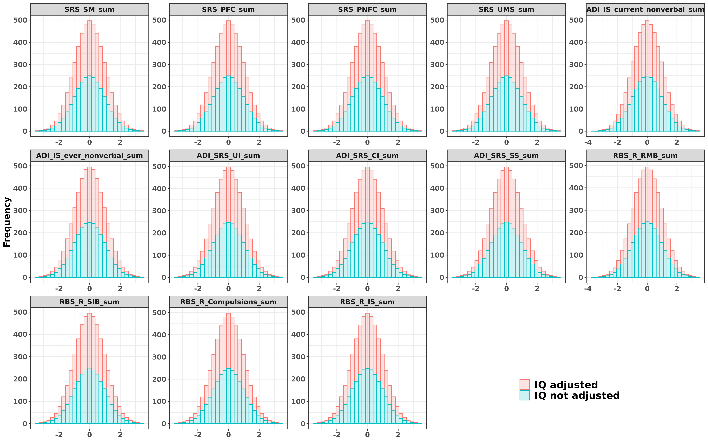
```

***
  
<br>

## Secondary Variables {.tabset .tabset-fade .tabset-pills}
### Not Adjusted
```{r eval=FALSE, include=FALSE}
index_sec <- which(colnames(phe) %in% summs$Secondary_Variable) ##24
sec_prob <- phe[,index_sec]
sec_prob$Adjust <- "Not adjusted"
sec_probII <- melt(sec_prob, id = "Adjust")
sec_probII <- sec_probII[grep("_sum", sec_probII$variable),]
muII <- mu[match(sec_probII$variable, mu$Variable),]
sec_probII$levels <- muII$Levels
sec_probII$Counts <- muII$Counts
sec_probII$Shared <- "Probands Only"
sec_probII[sec_probII$variable %in% colnames(phe_unaff), "Shared"] <- "Shared With Unaffected Siblings"

plot_sec_probII <- ggplot(sec_probII,aes(x = value, color = Shared, fill = Shared)) + 
  geom_histogram(alpha = 0.2) +
  geom_text( aes(label= paste0(Counts, " (", levels, ")"), x = 0, y = 250), hjust = -0.05 ) +
  facet_wrap(~variable,scales = "free", nrow = 3) +     
  
  theme_bw() +
  theme(
    text = element_text(size=14, face="bold"),
    axis.title.x = element_blank(),
    legend.position = "top",
    legend.text = element_text(size = 16),
    legend.title = element_blank()
  ) +
  ylab("Frequency") 

ggsave(file.path("figures/secondary_probands_Notadj.png"), plot_sec_probII, height = 10, width = 16, dpi = 300)
```

```{r p_sec_probII, out.width="100%", out.height="100%", dpi=300}
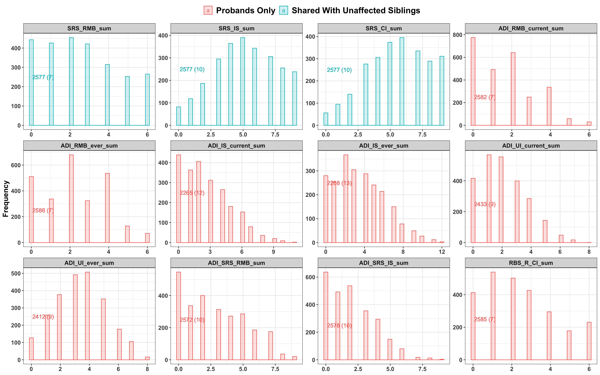
```


<br>

**Sample Sizes (Levels of phenotypes) are shown.**

***
  
  <br>
  
### Adjusted {.tabset .tabset-fade .tabset-pills}
#### PCs Excluded
```{r eval=FALSE, warning=FALSE, include=FALSE}
index_sec <- which(colnames(phe_adj1) %in% summs$Secondary_Variables) ##26
sec_prob1 <- phe_adj1[,index_sec]
sec_prob1$Adjust <- "IQ adjusted"

sec_prob2 <- phe_adj2[,index_sec]
sec_prob2$Adjust <- "IQ not adjusted"

sec_probs <- rbind(melt(sec_prob1, id = "Adjust"), melt(sec_prob2, id = "Adjust"))
sec_probs <- sec_probs[grep("sum", sec_probs$variable),]
plot_sec_probs <- ggplot(sec_probs,aes(x = value, color = Adjust, fill = Adjust)) + 
  facet_wrap(~variable,scales = "free", nrow = 3) + 
  geom_histogram(alpha = 0.2) +
  theme_bw() +
  theme(
    text = element_text(size=14, face="bold"),
    axis.title.x = element_blank(),
    legend.position = c(0.8,0.1),
    legend.text = element_text(size = 16),
    legend.title = element_blank()
  ) +
  ylab("Frequency") 
ggsave(file.path("figures/secondary_probands_adj.png"), plot_sec_probs, height = 10, width = 16, dpi = 300)
```

```{r plot_sec_probs1, out.width="100%", out.height="100%", dpi=300}
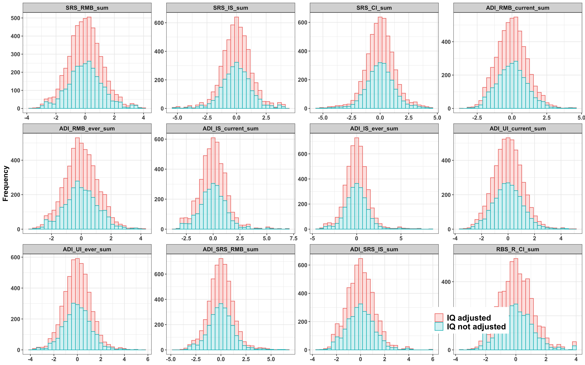
```

***
  
<br>

#### PCs Included
```{r eval=FALSE, warning=FALSE, include=FALSE}
index_sec <- intersect(colnames(phe_adj3), summs$Secondary_Variables) ##26
sec_prob1 <- phe_adj3[,index_sec]
sec_prob1$Adjust <- "IQ adjusted"

sec_prob2 <- phe_adj4[,index_sec]
sec_prob2$Adjust <- "IQ not adjusted"

sec_probs <- rbind(melt(sec_prob1, id = "Adjust"), melt(sec_prob2, id = "Adjust"))
sec_probs <- sec_probs[grep("sum", sec_probs$variable),]
plot_sec_probs <- ggplot(sec_probs,aes(x = value, color = Adjust, fill = Adjust)) + 
  facet_wrap(~variable,scales = "free", nrow = 3) + 
  geom_histogram(alpha = 0.2) +
  theme_bw() +
  theme(
    text = element_text(size=14, face="bold"),
    axis.title.x = element_blank(),
    legend.position = c(0.8,0.1),
    legend.text = element_text(size = 16),
    legend.title = element_blank()
  ) +
  ylab("Frequency") 
ggsave(file.path("/scratch/90days/uqywan67/auti_proj/SSC/outputs/secondary_probands_adjAndPCs.png"), plot_sec_probs, height = 10, width = 16, dpi = 300)
```

```{r plot_sec_probs2, out.width="100%", out.height="100%", dpi=300}
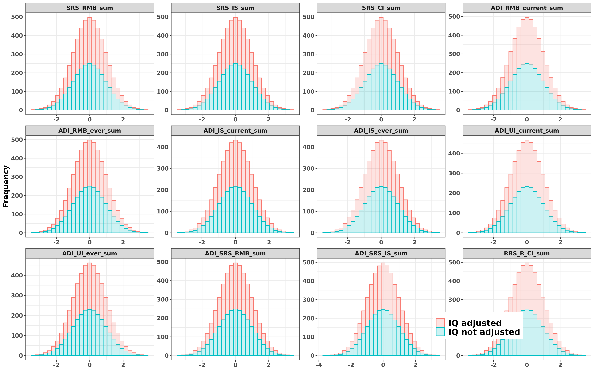
```

***
  
<br>  
  

# Unaffected Siblings  {.tabset .tabset-fade .tabset-pills}
- 7 shared phenotypes betwen Probands and Unaffected Siblings
- 3 Primary Variables
- 4 Secondary Variables
- Adjusted by **Sex, Chip** and then RINT.

```{r eval=FALSE, include=FALSE}
##adjusted for unaffected siblings
phe_unaff_m1 <- merge(x = phe_unaff, y = fams, id = c("FID", "IID"), all.x = T )
phe_unaff_m2 <- merge(x = phe_unaff_m1, y = pcs, id = c("FID", "IID"), all.x = T )

xnam <- paste("PC", 1:20, sep="")

phe_unaff_adj1 <- phe_unaff_adj2 <- phe_unaff_m2[,c("FID", "IID",  "sex",  "chip")]

for(ncol in 5:ncol(phe_unaff)){
  y <- colnames(phe_unaff)[ncol]
  dat <- phe_unaff_m2[,c(y, "sex",  "chip", paste0("PC", 1:20))]
  names(dat)[1] <- "Y"
  
  ##without PCs
  phe_unaff_resids <- resid(lm(Y ~  chip, data = dat, na.action=na.exclude))
  Tmp <- data.frame(phe_unaff_m2[,c("FID", "IID", "sex")], phe_unaff_resids)
  for(j in levels(factor(Tmp$sex))){
    Tmp[Tmp$sex == i, "phe_unaff_resids"]<- qnorm((rank(Tmp[Tmp$sex == i,]$phe_unaff_resids,na.last="keep") - 0.5)/sum(!is.na(Tmp[Tmp$sex == i,]$phe_unaff_resids))) 
  }
  phe_unaff_rint <- Tmp[match(phe_unaff_adj1$IID, Tmp$IID), "phe_unaff_resids"]
  phe_unaff_adj1[,(ncol)] <- phe_unaff_rint
  names(phe_unaff_adj1)[ncol] <- y

  ##adjust  PCs
  fmla <- as.formula(paste("Y ~  chip + ", paste(xnam, collapse= "+") ))
  phe_unaff_resid3 <- resid(lm(fmla, data = dat, na.action=na.exclude))
  ##RINT within sex
  tmp3 <- data.frame(phe_unaff_m2[,c("FID", "IID", "sex")], phe_unaff_resid3)
  for(i in levels(factor(tmp3$sex))){
    tmp3[tmp3$sex == i, "phe_unaff_resid3"]<- qnorm((rank(tmp3[tmp3$sex == i,]$phe_unaff_resid3,na.last="keep") - 0.5)/sum(!is.na(tmp3[tmp3$sex == i,]$phe_unaff_resid3))) 
  }
  phe_unaff_rint3 <- tmp3[match(phe_unaff_adj2$IID, tmp3$IID), "phe_unaff_resid3"]
  phe_unaff_adj2[,(ncol)] <- phe_unaff_rint3
  names(phe_unaff_adj2)[ncol] <- y
}

save(phe_unaff_adj1, file = "../outputs/phe_adj_unaffSibs.Rdata")
save(phe_unaff_adj1, file = "~/rcc/autism_proj/SSC/output/phe_adj_unaffSibs.Rdata")

write.table(phe_unaff_adj1, file = "~/cnsg/auti/SSC/phenotypes/RRBs/phe_adjWithoutPCs_unaffSibs.txt", col.names = T, row.names = F, quote = F, sep = "\t")
write.table(phe_unaff_adj2, file = "~/cnsg/auti/SSC/phenotypes/RRBs/phe_adjWithPCs_unaffSibs.txt", col.names = T, row.names = F, quote = F, sep = "\t")
##generate plot
index_shared <- which(colnames(phe_unaff[5:ncol(phe_unaff)]) %in% colnames(phe[10:ncol(phe)])) ##14
shared_prob <- phe_unaff[,(4 + index_shared)]
shared_prob$Adjust <- "Not adjusted"
shared_probII <- melt(shared_prob, id = "Adjust")
shared_probII <- shared_probII[grep("_sum", shared_probII$variable),]
mu2$Variable <- gsub("_Unaff_Sibs", "", mu2$Variable)
mu2II <- mu2[match(shared_probII$variable, mu2$Variable),]
shared_probII$levels <- mu2II$Levels
shared_probII$Counts <- mu2II$Counts
shared_probII$Interests <- "NA"
shared_probII[shared_probII$variable %in% summs$Primary_Variable, "Interests"] <- "Primary Variable"
shared_probII[shared_probII$variable %in% summs$Secondary_Variables, "Interests"] <- "Secondary Variable"

plot_shared_probII <- ggplot(shared_probII,aes(x = value, color = Interests, fill = Interests)) + 
  geom_histogram(alpha = 0.2) +
  geom_text( aes(label= paste0(Counts, " (", levels, ")"), x = 0, y = 250), hjust = -0.05 ) +
  facet_wrap(~variable,scales = "free", nrow = 2) +     
  
  theme_bw() +
  theme(
    text = element_text(size=14, face="bold"),
    axis.title.x = element_blank(),
    legend.position = c(0.9,0.2),
    legend.text = element_text(size = 16),
    legend.title = element_blank()
  ) +
  ylab("Frequency") 

ggsave(file.path("figures/UnaffSibs_shared_Notadj.png"), plot_shared_probII, height = 6, width = 12, dpi = 300)

```

```{r merge_prob_unaff, eval=FALSE, include=FALSE}
setwd("/afm01/UQ/Q3490/SSC/phenotypes")
phe_unaff <- read.table("Unaffected_Siblings_matchedID_cleaned.txt", header = T, stringsAsFactors = F)
phe <- read.table("Probands_Key_Variables_matchedID_cleaned.txt", header = T, stringsAsFactors = F)
colnames(phe_unaff) <- gsub("_Unaff_Sibs", "", colnames(phe_unaff))
phe_unaff$Group <- "Unaffected_Siblings"
phe$Group <- "Probands"
names_com <- intersect(colnames(phe_unaff) , colnames(phe))
phe_unaff1 <- phe_unaff[,names_com]
phe1 <- phe[,names_com]
phe_comb1 <- rbind(phe1, phe_unaff1)
write.table(phe_comb1, file = "phe_probandsCombunaffSibs_raw.txt", col.names = T, row.names = F, quote = F, sep = "\t")

phe_adj1 <- read.table("phe_adjWithIQ_probands.txt", header = T, stringsAsFactors = F)
phe_adj2 <- read.table("phe_adjWithoutIQ_probands.txt", header = T, stringsAsFactors = F)
phe_unaff_adj1 <- read.table("phe_adjWithoutPCs_unaffSibs.txt", header = T, stringsAsFactors = F)
phe_unaff_adj1$Group <- "Unaffected_Siblings"
phe_adj1$Group <- "Probands"
phe_adj2$Group <- "Probands"

names_com2 <- intersect(colnames(phe_unaff_adj1) , colnames(phe_adj1))
phe_unaff_adj1II <- phe_unaff_adj1[,names_com2]
phe_adj1II <- phe_adj1[,names_com2]
phe_adj2II <- phe_adj2[,names_com2]

phe_comb2 <- rbind(phe_adj1II, phe_unaff_adj1II)
phe_comb3 <- rbind(phe_adj2II, phe_unaff_adj1II)

write.table(phe_comb2, file = "phe_probands_adjWithIQ_CombunaffSibs.txt", col.names = T, row.names = F, quote = F, sep = "\t")
write.table(phe_comb3, file = "phe_probands_adjWithoutIQ_CombunaffSibs.txt", col.names = T, row.names = F, quote = F, sep = "\t")

##with PCs
phe_adj_1 <- read.table("phe_adjPCsWithIQ_probands.txt", header = T, stringsAsFactors = F)
phe_adj_2 <- read.table("phe_adjPCsWithoutIQ_probands.txt", header = T, stringsAsFactors = F)
phe_unaff_adj_1 <- read.table("phe_adjWithPCs_unaffSibs.txt", header = T, stringsAsFactors = F)
phe_unaff_adj_1$Group <- "Unaffected_Siblings"
phe_adj_1$Group <- "Probands"
phe_adj_2$Group <- "Probands"

names_com2 <- intersect(colnames(phe_unaff_adj_1) , colnames(phe_adj_1))
names_com3 <- intersect(colnames(phe_unaff_adj_1) , colnames(phe_adj_2))
phe_unaff_adj_1II <- phe_unaff_adj_1[,names_com2]
phe_adj_1II <- phe_adj_1[,names_com2]
phe_adj_2II <- phe_adj_2[,names_com3]
phe_adj_2II$chip <- phe_adj_1[match(phe_adj_2II$IID, phe_adj_1$IID), "chip"] 
phe_adj_2II <- phe_adj_2II[,c(1:3,19, 4:18)]

phe_comb4 <- rbind(phe_adj_1II, phe_unaff_adj_1II)
phe_comb5 <- rbind(phe_adj_2II, phe_unaff_adj_1II)


write.table(phe_comb4, file = "phe_probands_adjPCsWithIQ_CombunaffSibs.txt", col.names = T, row.names = F, quote = F, sep = "\t")
write.table(phe_comb5, file = "phe_probands_adjPCsWithoutIQ_CombunaffSibs.txt", col.names = T, row.names = F, quote = F, sep = "\t")
```

## Not Adjusted
```{r plot_shared_notadj, out.height="100%", out.width="100%"}
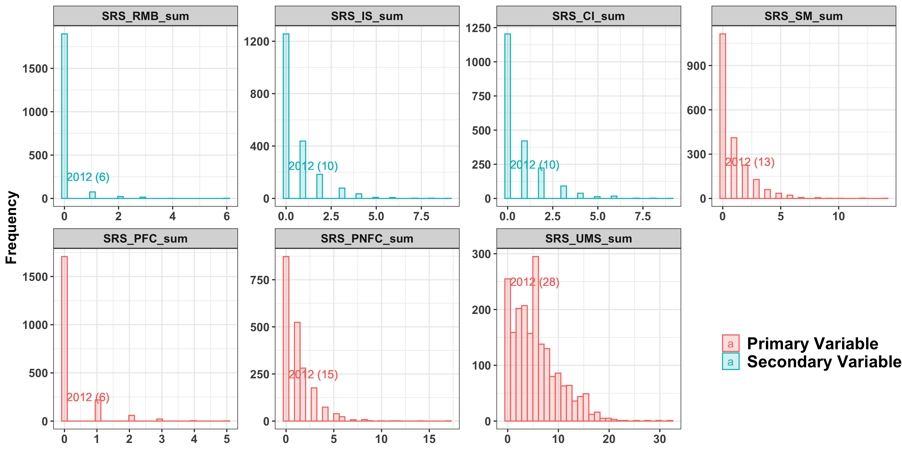
```

<br>

**Sample Sizes (Levels of phenotypes) are shown.**

*** 

<br>

## Adjusted  {.tabset .tabset-fade .tabset-pills}
### PCs Excluded
```{r eval=FALSE, include=FALSE}
index_shared <- which(colnames(phe_unaff_adj1[5:ncol(phe_unaff_adj1)]) %in% colnames(phe[10:ncol(phe)])) ##14
shared_adj_prob <- phe_unaff_adj1[,(4 + index_shared)]
shared_adj_prob$Adjust <- "Adjusted"
shared_adj_probII <- melt(shared_adj_prob, id = "Adjust")
shared_adj_probII <- shared_adj_probII[grep("_sum", shared_adj_probII$variable),]
mu2$Variable <- gsub("_Unaff_Sibs", "", mu2$Variable)
mu2II <- mu2[match(shared_adj_probII$variable, mu2$Variable),]
shared_adj_probII$levels <- mu2II$Levels
shared_adj_probII$Counts <- mu2II$Counts
shared_adj_probII$Interests <- "NA"
shared_adj_probII[shared_adj_probII$variable %in% summs$Primary_Variable, "Interests"] <- "Primary Variable"
shared_adj_probII[shared_adj_probII$variable %in% summs$Secondary_Variables, "Interests"] <- "Secondary Variable"

plot_shared_adj_probII <- ggplot(shared_adj_probII,aes(x = value, color = Interests, fill = Interests)) + 
  geom_histogram(alpha = 0.2) +
  #geom_text( aes(label= paste0(Counts, " (", levels, ")"), x = 0, y = 250), hjust = -0.05 ) +
  facet_wrap(~variable,scales = "free", nrow = 2) +     
  
  theme_bw() +
  theme(
    text = element_text(size=14, face="bold"),
    axis.title.x = element_blank(),
    legend.position = c(0.9,0.2),
    legend.text = element_text(size = 16),
    legend.title = element_blank()
  ) +
  ylab("Frequency") 

ggsave(file.path("figures/UnaffSibs_shared_adj.png"), plot_shared_adj_probII, height = 6, width = 12, dpi = 300)

```

```{r plot_shared_adj1, out.height="100%", out.width="100%"}
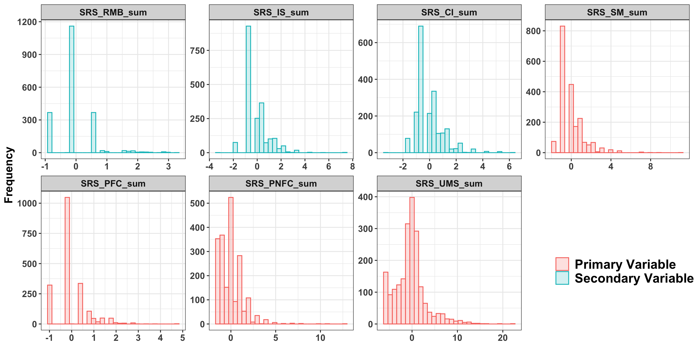
```

*** 

<br>

### PCs Included
```{r eval=FALSE, include=FALSE}
library(reshape2)
library(ggplot2)
setwd("/scratch/90days/uqywan67/auti_proj/SSC/phenotypes")
phe <- read.table("Probands_Key_Variables_matchedID_cleaned.txt", header = T, stringsAsFactors = F)
phe_unaff_adj1 <- read.table("phe_adjWithPCs_unaffSibs.txt", header = T, stringsAsFactors = F)
summs <- read.table("phenotype_variable_summary.txt", header = T, stringsAsFactors = F)
index_shared <- intersect(colnames(phe_unaff_adj1[5:ncol(phe_unaff_adj1)]), colnames(phe[10:ncol(phe)])) ##14
shared_adj_prob <- phe_unaff_adj1[,(index_shared)]
shared_adj_prob$Adjust <- "Adjusted"
shared_adj_probII <- melt(shared_adj_prob, id = "Adjust")
shared_adj_probII <- shared_adj_probII[grep("_sum", shared_adj_probII$variable),]

shared_adj_probII$Interests <- "NA"
shared_adj_probII[shared_adj_probII$variable %in% summs$Primary_Variable, "Interests"] <- "Primary Variable"
shared_adj_probII[shared_adj_probII$variable %in% summs$Secondary_Variables, "Interests"] <- "Secondary Variable"

plot_shared_adj_probII <- ggplot(shared_adj_probII,aes(x = value, color = Interests, fill = Interests)) + 
  geom_histogram(alpha = 0.2) +
  #geom_text( aes(label= paste0(Counts, " (", levels, ")"), x = 0, y = 250), hjust = -0.05 ) +
  facet_wrap(~variable,scales = "free", nrow = 2) +     
  
  theme_bw() +
  theme(
    text = element_text(size=14, face="bold"),
    axis.title.x = element_blank(),
    legend.position = c(0.9,0.2),
    legend.text = element_text(size = 16),
    legend.title = element_blank()
  ) +
  ylab("Frequency") 

ggsave(file.path("/scratch/90days/uqywan67/auti_proj/SSC/outputs/UnaffSibs_shared_adjAndPCs.png"), plot_shared_adj_probII, height = 6, width = 12, dpi = 300)

```

```{r plot_shared_adj, out.height="100%", out.width="100%"}
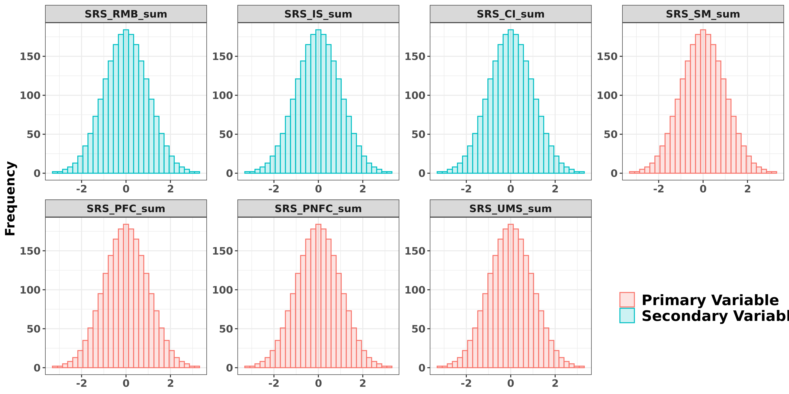
```

*** 

<br>


# Probands & Unaffected Siblings  {.tabset .tabset-fade .tabset-pills}
- 7 shared phenotypes of Probands and Unaffected Siblings
- show phenotype distribution both separately and combined
```{r eval=FALSE, include=F}
setwd("/afm01/UQ/Q3490/SSC/phenotypes")
phes1 <- read.table("phe_probandsCombunaffSibs_raw.txt", header = T, stringsAsFactors = F)
phes2 <- read.table("phe_probands_adjWithIQ_CombunaffSibs.txt", header = T, stringsAsFactors = F)
phes3 <- read.table("phe_probands_adjWithoutIQ_CombunaffSibs.txt", header = T, stringsAsFactors = F)
library(reshape2)
library(ggplot2)
phes1_2 <- melt(phes1, id = c("FID", "IID", "individual", "sex", "Group"))
phes2_2 <- melt(phes2, id = c("FID", "IID", "chip", "sex", "Group"))
phes3_2 <- melt(phes3, id = c("FID", "IID", "chip", "sex", "Group"))
phes1_2 <- phes1_2[grep("sum", phes1_2$variable),]
phes2_2 <- phes2_2[grep("sum", phes2_2$variable),]
phes3_2 <- phes3_2[grep("sum", phes3_2$variable),]

plot_phes1_2 <- ggplot(phes1_2 ,aes(x = value, color = Group, fill = Group)) + 
  geom_histogram(alpha = 0.2) +
  #geom_text( aes(label= paste0(Counts, " (", levels, ")"), x = 0, y = 250), hjust = -0.05 ) +
  facet_wrap(~variable,scales = "free", nrow = 2) +     
  theme_bw() +
  theme(
    text = element_text(size=14, face="bold"),
    axis.title.x = element_blank(),
    legend.position = c(0.9,0.2),
    legend.text = element_text(size = 12),
    legend.title = element_blank()
  ) +
  ylab("Frequency") 

ggsave(file.path("/scratch/90days/uqywan67/auti_proj/SSC/outputs/probandsAndunaffSibs_raw.png"), plot_phes1_2, height = 6, width = 12, dpi = 300)

plot_phes2_2 <- ggplot(phes2_2 ,aes(x = value, color = Group, fill = Group)) + 
  geom_histogram(alpha = 0.2) +
  #geom_text( aes(label= paste0(Counts, " (", levels, ")"), x = 0, y = 250), hjust = -0.05 ) +
  facet_wrap(~variable,scales = "free", nrow = 2) +     
  theme_bw() +
  theme(
    text = element_text(size=14, face="bold"),
    axis.title.x = element_blank(),
    legend.position = c(0.9,0.2),
    legend.text = element_text(size = 12),
    legend.title = element_blank()
  ) +
  ylab("Frequency") 

ggsave(file.path("/scratch/90days/uqywan67/auti_proj/SSC/outputs/probandsAndunaffSibs_adjIQ.png"), plot_phes2_2, height = 6, width = 12, dpi = 300)

plot_phes3_2 <- ggplot(phes3_2 ,aes(x = value, color = Group, fill = Group)) + 
  geom_histogram(alpha = 0.2) +
  #geom_text( aes(label= paste0(Counts, " (", levels, ")"), x = 0, y = 250), hjust = -0.05 ) +
  facet_wrap(~variable,scales = "free", nrow = 2) +     
  theme_bw() +
  theme(
    text = element_text(size=14, face="bold"),
    axis.title.x = element_blank(),
    legend.position = c(0.9,0.2),
    legend.text = element_text(size = 12),
    legend.title = element_blank()
  ) +
  ylab("Frequency") 

ggsave(file.path("/scratch/90days/uqywan67/auti_proj/SSC/outputs/probandsAndunaffSibs_adjnoIQ.png"), plot_phes3_2, height = 6, width = 12, dpi = 300)

##########combined
plot_phes1_2II <- ggplot(phes1_2 ,aes(x = value, color = "#E69F00", fill = "#E69F00")) + 
  geom_histogram(alpha = 0.2) +
  #geom_text( aes(label= paste0(Counts, " (", levels, ")"), x = 0, y = 250), hjust = -0.05 ) +
  facet_wrap(~variable,scales = "free", nrow = 2) +     
  theme_bw() +
  theme(
    text = element_text(size=14, face="bold"),
    axis.title.x = element_blank(),
    legend.position = "none",
    legend.text = element_text(size = 12),
    legend.title = element_blank()
  ) +
  ylab("Frequency") 

ggsave(file.path("/scratch/90days/uqywan67/auti_proj/SSC/outputs/probandsAndunaffSibs_rawII.png"), plot_phes1_2II, height = 6, width = 12, dpi = 300)

plot_phes2_2II <- ggplot(phes2_2 ,aes(x = value, color = "#E69F00", fill = "#E69F00")) + 
  geom_histogram(alpha = 0.2) +
  #geom_text( aes(label= paste0(Counts, " (", levels, ")"), x = 0, y = 250), hjust = -0.05 ) +
  facet_wrap(~variable,scales = "free", nrow = 2) +     
  theme_bw() +
  theme(
    text = element_text(size=14, face="bold"),
    axis.title.x = element_blank(),
    legend.position = "none",
    legend.text = element_text(size = 12),
    legend.title = element_blank()
  ) +
  ylab("Frequency") 

ggsave(file.path("/scratch/90days/uqywan67/auti_proj/SSC/outputs/probandsAndunaffSibs_adjIQII.png"), plot_phes2_2II, height = 6, width = 12, dpi = 300)

plot_phes3_2II <- ggplot(phes3_2 ,aes(x = value, color = "#E69F00", fill = "#E69F00")) + 
  geom_histogram(alpha = 0.2) +
  #geom_text( aes(label= paste0(Counts, " (", levels, ")"), x = 0, y = 250), hjust = -0.05 ) +
  facet_wrap(~variable,scales = "free", nrow = 2) +     
  theme_bw() +
  theme(
    text = element_text(size=14, face="bold"),
    axis.title.x = element_blank(),
    legend.position = "none",
    legend.text = element_text(size = 12),
    legend.title = element_blank()
  ) +
  ylab("Frequency") 

ggsave(file.path("/scratch/90days/uqywan67/auti_proj/SSC/outputs/probandsAndunaffSibs_adjnoIQII.png"), plot_phes3_2II, height = 6, width = 12, dpi = 300)

```

```{r plot_withPCs, eval=FALSE, include=F}
setwd("/scratch/90days/uqywan67/auti_proj/SSC/phenotypes")
phes1 <- read.table("phe_probandsCombunaffSibs_raw.txt", header = T, stringsAsFactors = F)
phes2 <- read.table("phe_probands_adjPCsWithIQ_CombunaffSibs.txt", header = T, stringsAsFactors = F)
phes3 <- read.table("phe_probands_adjPCsWithoutIQ_CombunaffSibs.txt", header = T, stringsAsFactors = F)
library(reshape2)
library(ggplot2)
phes1_2 <- melt(phes1, id = c("FID", "IID", "individual", "sex", "Group"))
phes2_2 <- melt(phes2, id = c("FID", "IID", "chip", "sex", "Group"))
phes3_2 <- melt(phes3, id = c("FID", "IID", "chip", "sex", "Group"))
phes1_2 <- phes1_2[grep("sum", phes1_2$variable),]
phes2_2 <- phes2_2[grep("sum", phes2_2$variable),]
phes3_2 <- phes3_2[grep("sum", phes3_2$variable),]


plot_phes2_2 <- ggplot(phes2_2 ,aes(x = value, color = Group, fill = Group)) + 
  geom_histogram(alpha = 0.2) +
  #geom_text( aes(label= paste0(Counts, " (", levels, ")"), x = 0, y = 250), hjust = -0.05 ) +
  facet_wrap(~variable,scales = "free", nrow = 2) +     
  theme_bw() +
  theme(
    text = element_text(size=14, face="bold"),
    axis.title.x = element_blank(),
    legend.position = c(0.9,0.2),
    legend.text = element_text(size = 12),
    legend.title = element_blank()
  ) +
  ylab("Frequency") 

ggsave(file.path("/scratch/90days/uqywan67/auti_proj/SSC/outputs/probandsAndunaffSibs_adjIQ_withPCs.png"), plot_phes2_2, height = 6, width = 12, dpi = 300)

plot_phes3_2 <- ggplot(phes3_2 ,aes(x = value, color = Group, fill = Group)) + 
  geom_histogram(alpha = 0.2) +
  #geom_text( aes(label= paste0(Counts, " (", levels, ")"), x = 0, y = 250), hjust = -0.05 ) +
  facet_wrap(~variable,scales = "free", nrow = 2) +     
  theme_bw() +
  theme(
    text = element_text(size=14, face="bold"),
    axis.title.x = element_blank(),
    legend.position = c(0.9,0.2),
    legend.text = element_text(size = 12),
    legend.title = element_blank()
  ) +
  ylab("Frequency") 

ggsave(file.path("/scratch/90days/uqywan67/auti_proj/SSC/outputs/probandsAndunaffSibs_adjnoIQ_withPCs.png"), plot_phes3_2, height = 6, width = 12, dpi = 300)

##########combined
plot_phes2_2II <- ggplot(phes2_2 ,aes(x = value, color = "#E69F00", fill = "#E69F00")) + 
  geom_histogram(alpha = 0.2) +
  #geom_text( aes(label= paste0(Counts, " (", levels, ")"), x = 0, y = 250), hjust = -0.05 ) +
  facet_wrap(~variable,scales = "free", nrow = 2) +     
  theme_bw() +
  theme(
    text = element_text(size=14, face="bold"),
    axis.title.x = element_blank(),
    legend.position = "none",
    legend.text = element_text(size = 12),
    legend.title = element_blank()
  ) +
  ylab("Frequency") 

ggsave(file.path("/scratch/90days/uqywan67/auti_proj/SSC/outputs/probandsAndunaffSibs_adjIQII_withPCs.png"), plot_phes2_2II, height = 6, width = 12, dpi = 300)

plot_phes3_2II <- ggplot(phes3_2 ,aes(x = value, color = "#E69F00", fill = "#E69F00")) + 
  geom_histogram(alpha = 0.2) +
  #geom_text( aes(label= paste0(Counts, " (", levels, ")"), x = 0, y = 250), hjust = -0.05 ) +
  facet_wrap(~variable,scales = "free", nrow = 2) +     
  theme_bw() +
  theme(
    text = element_text(size=14, face="bold"),
    axis.title.x = element_blank(),
    legend.position = "none",
    legend.text = element_text(size = 12),
    legend.title = element_blank()
  ) +
  ylab("Frequency") 

ggsave(file.path("/scratch/90days/uqywan67/auti_proj/SSC/outputs/probandsAndunaffSibs_adjnoIQII_withPCs.png"), plot_phes3_2II, height = 6, width = 12, dpi = 300)

```
## Separated {.tabset .tabset-fade .tabset-pills}
### Raw
```{r  out.width="100%", out.height="100%", dpi=300}
knitr::include_graphics("figures/probandsAndunaffSibs_raw.png")
```

***

<br>

### PCs Excluded {.tabset .tabset-fade .tabset-pills}
#### Fitting IQ
```{r  out.width="100%", out.height="100%", dpi=300}
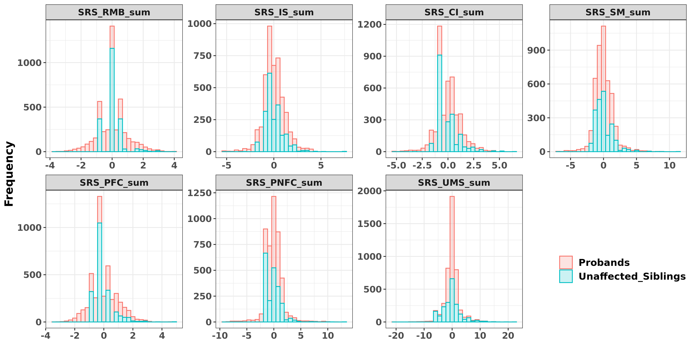
```

***

<br>

#### Not Fitting IQ
```{r  out.width="100%", out.height="100%", dpi=300}
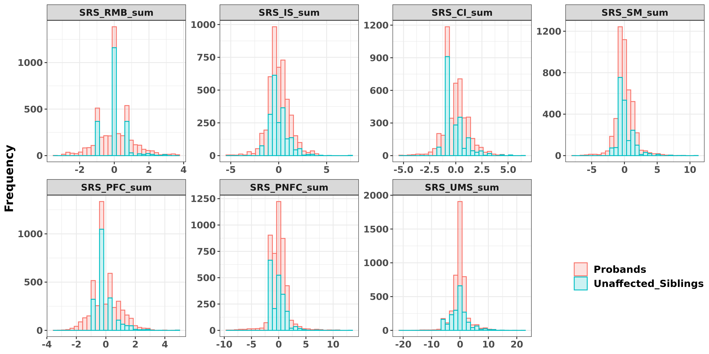
```

***

<br>


### PCs Included {.tabset .tabset-fade .tabset-pills}
#### Fitting IQ
```{r  out.width="100%", out.height="100%", dpi=300}

```

***

<br>

#### Not Fitting IQ
```{r  out.width="100%", out.height="100%", dpi=300}
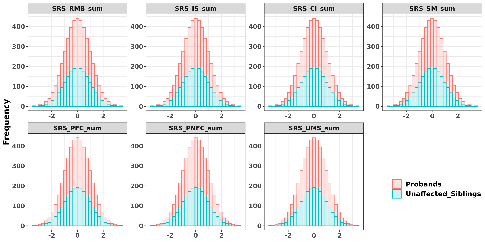
```

***

<br>

## Combined {.tabset .tabset-fade .tabset-pills}
### Raw
```{r  out.width="100%", out.height="100%", dpi=300}
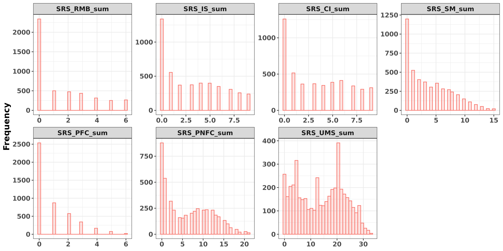
```

***

<br>

### PCs Excluded {.tabset .tabset-fade .tabset-pills}
#### Fitting IQ
```{r  out.width="100%", out.height="100%", dpi=300}
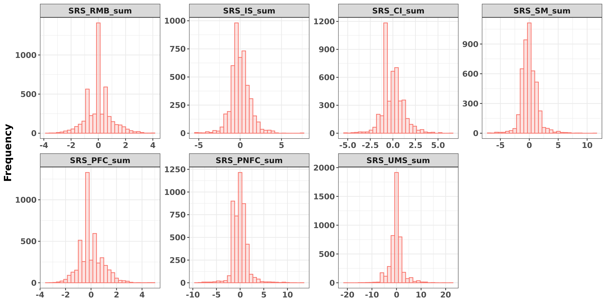
```

***

<br>

#### Not Fitting IQ
```{r  out.width="100%", out.height="100%", dpi=300}
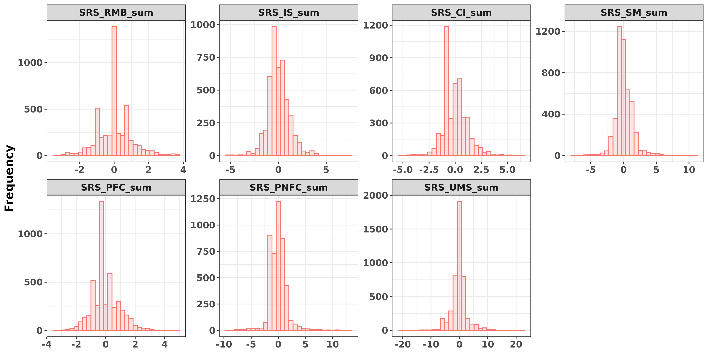
```

***

<br>


### PCs Included {.tabset .tabset-fade .tabset-pills}
#### Fitting IQ
```{r  out.width="100%", out.height="100%", dpi=300}

```

***

<br>

#### Not Fitting IQ
```{r  out.width="100%", out.height="100%", dpi=300}
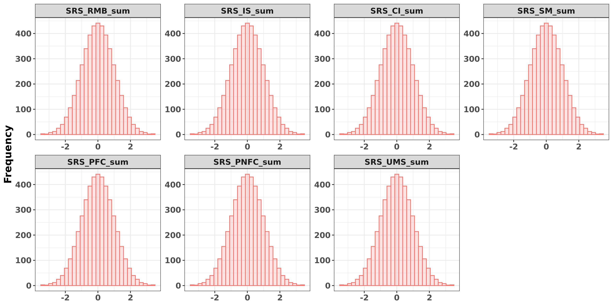
```

***

<br>


