<!-- <style> -->
<!-- img { -->
<!--     max-width: none; -->

<!--     /* other options: -->
<!--     max-width: 200%; -->
<!--     max-width: 700px; -->
<!--     max-width: 9in; -->
<!--     max-width: 25cm; -->
<!--     etc -->
<!--     */ -->
<!-- } -->

<style>
a:link {
    color: black;
}
a:visited {
    color: black;
}
 a:hover {
    color: black;
}
</style>

<style type="text/css">
  .list-group-item.active, .list-group-item.active:focus, .list-group-item.active:hover {
    z-index: 2;
    color: #000000;
    background-color: #FFFFFF;
    border-color: #000000;
}
</style>

```{r setup, include=FALSE}

WD="~/OneDrive - The University of Queensland/mater_projs/auti_proj/AutismSpeaks_SSC/"
knitr::opts_chunk$set(echo = TRUE)
knitr::opts_chunk$set(warnings = FALSE)
knitr::opts_chunk$set(message  = FALSE)
#knitr::opts_chunk$set(eval = FALSE)
knitr::opts_knit$set(root.dir = WD)

library(reshape2)
library(ggplot2)
library(plyr)
library(knitr)
library(rmarkdown)
library(dplyr)
library(plotly)
library(gapminder)
library(DT)
require("ggrepel")
library(grid)
library(gridExtra)
```

***

 
# ID code consistency between .fam and RRB phenotypes
- The .fam IDs and RRB phenotype IDs are not consistent
- A match list can be found in microarray/Microarray_clean.txt
- Then update RRB phenotypes based on .fam IDs 


```{r, eval = FALSE, include=FALSE}
setwd("/gpfs1/scratch/group30days/cnsg_park/uqywan/auti/SSC")

fam1 <- read.table("microarray/UCSF_1Mv3/SSC_1Mv3_binary.fam", stringsAsFactors = F) ##1189 families
fam2 <- read.table("microarray/UCSF_1Mv1/SSC_1Mv1_binary.fam", stringsAsFactors = F) ##333 families
fam3 <- read.table("microarray/UCSF_Omni2.5/SSC_Omni2.5_binary.fam", stringsAsFactors = F) ##1069 families

fam1$chip <- "1Mv3"
fam2$chip <- "1Mv1"
fam3$chip <- "Omni2.5"

fam <- rbind(fam1, fam2, fam3) ##10220 individuals
print(nrow(fam) == length(unique(fam$V2)))

# > table(fam$V6) ##phenotype
# 
# 1    2 
# 7615 2605 
# > table(fam$V5) ##sex
# 
# 1    2 
# 5994 4226 

## Update SPSS format to plain text format for phenotype files
setwd("~/OneDrive - The University of Queensland/papers")

files <- list.files(path = ".", pattern = "*.sav")
library(foreign)
###Note there are blank cells for Probands  (##race and sex) and Unaffected Siblings (##sex)
for(file in files){
  df <- read.spss(file, use.value.label=TRUE, to.data.frame=TRUE)
  
  if("sex" %in% colnames(df)){
    df[!grepl("[a-z]", df$sex, fixed = F),]$sex <- "Unknown"
  }
  if("race" %in% colnames(df)){
    df[!grepl("[a-z]", df$race, fixed = F),]$race <- "Unknown"
  }
  file1 <- gsub(".sav", "", file)
  write.table(df, file = paste0(file1, ".txt"), col.names = T, row.names = F, quote = F, sep = "\t")
}


phe1 <- read.table("phenotypes/RRBs/Probands_Key_Variables.txt", stringsAsFactors = F, header = T) ##2856
phe2 <- read.table("phenotypes/RRBs/Unaffected_Siblings.txt", stringsAsFactors = F, header = T) ##2365
phe3 <- read.table("phenotypes/RRBs/Other_Siblings.txt", stringsAsFactors = F, header = T) ##337

###Note the IID did not match between phenotype and genotype files. the ID pairs is stored in Microarray_clean.xlsx
library("readxl")
res <- data.frame(read_excel("microarray/Microarray_clean.xlsx"))
write.table(res, file = "microarray/Microarray_clean.txt", col.names = T, row.names = F, quote = F, sep = "\t")

phe1$FID <- res[match(phe1$individual, res$individual),]$family
phe1$IID <- res[match(phe1$individual, res$individual),]$array
phe2$FID <- res[match(phe2$individual, res$individual),]$family
phe2$IID <- res[match(phe2$individual, res$individual),]$array
phe3$FID <- res[match(phe3$individual, res$individual),]$family
phe3$IID <- res[match(phe3$individual, res$individual),]$array

phe1 <- phe1[,c(58:59,1:57)]
phe2 <- phe2[,c(29:30,1:28)]
phe3 <- phe3[,c(28:29,1:27)]

colnames(phe1) <- gsub("_Proband", "", colnames(phe1))
colnames(phe2) <- gsub("_Unaffected_Siblings", "", colnames(phe2))
colnames(phe3) <- gsub("_Other_Siblings", "", colnames(phe3))

##remove NA based on FID
phe1_2 <- phe1[complete.cases(phe1$FID),]
phe2_2 <- phe2[complete.cases(phe2$FID),]
phe3_2 <- phe3[complete.cases(phe3$FID),]

fam$Rel <- "NA"
fam[fam$V2 %in% phe1_2$IID, "Rel"] <- "Probands"
fam[fam$V2 %in% phe2_2$IID, "Rel"] <- "Unaffected_Siblings"
fam[fam$V2 %in% phe3_2$IID, "Rel"] <- "Other_Siblings"

fam$Age <- "NA"
fam[fam$V2 %in% phe1_2$IID, "Age"] <- phe1_2[match(fam[fam$V2 %in% phe1_2$IID, "V2"], phe1_2$IID), "Age"]

fam$Race <- "NA"
fam[fam$V2 %in% phe1_2$IID, "race"] <- phe1_2[match(fam[fam$V2 %in% phe1_2$IID, "V2"], phe1_2$IID), "race"]

write.table(fam, file = "outputs/fams_covarites.txt", col.names = F, row.names = F, quote = F, sep = "\t")

write.table(phe1, file = "phenotypes/RRBs/Probands_Key_Variables_matchedID.txt", col.names = T, row.names = F, quote = F, sep = "\t")
write.table(phe2, file = "phenotypes/RRBs/Unaffected_Siblings_matchedID.txt", col.names = T, row.names = F, quote = F, sep = "\t")
write.table(phe3, file = "phenotypes/RRBs/Other_Siblings_matchedID.txt", col.names = T, row.names = F, quote = F, sep = "\t")

write.table(phe1_2, file = "phenotypes/RRBs/Probands_Key_Variables_matchedID_cleaned.txt", col.names = T, row.names = F, quote = F, sep = "\t")
write.table(phe2_2, file = "phenotypes/RRBs/Unaffected_Siblings_matchedID_cleaned.txt", col.names = T, row.names = F, quote = F, sep = "\t")
write.table(phe3_2, file = "phenotypes/RRBs/Other_Siblings_matchedID_cleaned.txt", col.names = T, row.names = F, quote = F, sep = "\t")


GRMDIR="/90days/uqywan67/autism_proj/SSC/grm/"
write.table(phe1_2[1:2], file = paste0(GRMDIR, "Probands_matchedID_cleaned.ids"), col.names = F, row.names = F, quote = F, sep = "\t")
write.table(phe2_2[1:2], file = paste0(GRMDIR, "Unaffected_Siblings_matchedID_cleaned.ids"), col.names = F, row.names = F, quote = F, sep = "\t")
write.table(phe3_2[1:2], file = paste0(GRMDIR, "Other_Siblings_matchedID_cleaned.ids"), col.names = F, row.names = F, quote = F, sep = "\t")
write.table(rbind(phe1_2[1:2], phe2_2[1:2]), file = paste0(GRMDIR, "Probands_Unaffected_Siblings_matchedID_cleaned.ids"), col.names = F, row.names = F, quote = F, sep = "\t")
write.table(rbind(phe1_2[1:2],phe2_2[1:2], phe2_2[1:2]), file = paste0(GRMDIR, "Probands_Unaffected_Siblings_Other_Siblings_matchedID_cleaned.ids"), col.names = F, row.names = F, quote = F, sep = "\t")
```


***

<br>

# Structure of three SSC chips {.tabset .tabset-fade .tabset-pills}

- 10220 Individuals from 2591 SSC families were genotyped on three chips. 
- Note that members of each family were analyzed on the same array. 

## Illumina 1Mv3 

- 1189 families
- 4626 people (2703 males, 1923 females)
- 1199033 SNPs

***

<br>


## Illumina 1Mv1 
- 333 families
- 1354 people (801 males, 553 females)
- 1072814 SNPs

***

<br>


## Illumina HumanOmni2.5M 
- 1069 families
- 4240 people (2490 males, 1750 females)
- 2440283 SNPs


```{r, eval = FALSE, include=FALSE}
## check the structure of three chips
bim1 <- read.table("microarray/UCSF_1Mv3/SSC_1Mv3_binary.bim", stringsAsFactors = F) ##1199033 SNPs
bim2 <- read.table("microarray/UCSF_1Mv1/SSC_1Mv1_binary.bim", stringsAsFactors = F) ##1072814 SNPs
bim3 <- read.table("microarray/UCSF_Omni2.5/SSC_Omni2.5_binary.bim", stringsAsFactors = F) ##2440283 SNPs

## common SNPs among three chips
coms <- Reduce(intersect, list(bim1$V2, bim2$V2, bim3$V2)) ##528891 SNPs

fam1$chip <- "1Mv3"
fam2$chip <- "1Mv1"
fam3$chip <- "Omni2.5"
fam <- rbind(fam1, fam2, fam3) ##10220 individuals

phe1 <- read.table("phenotypes/RRBs/Probands_Key_Variables_matchedID_cleaned.txt", stringsAsFactors = F, header = T) ##2856
phe2 <- read.table("phenotypes/RRBs/Unaffected_Siblings_matchedID_cleaned.txt", stringsAsFactors = F, header = T) ##2365
phe3 <- read.table("phenotypes/RRBs/Other_Siblings_matchedID_cleaned.txt", stringsAsFactors = F, header = T) ##337
phe1$category <- "Probands"
phe2$category <- "Unaffected_Siblings"
phe3$category <- "Other_Siblings"
phe <- rbind(phe1[,c("FID", "IID", "category")], phe2[,c("FID", "IID", "category")], phe3[,c("FID", "IID", "category")])
phe$chip <- fam[match(phe$IID, fam$V2),]$chip

# > table(phe$chip, phe$category)
# 
# Other_Siblings Probands Unaffected_Siblings
# 1Mv1                45      333                 301
# 1Mv3               123     1187                 913
# Omni2.5            128     1068                 884
```

***
<br>


# RRB phenotypes

## Phenotype discription {.tabset .tabset-fade .tabset-pills}
- phenotype counts and levels 
- primary and secondary variable information for probands
```{r generate_phe_summary, eval=F, include=FALSE}
setwd("~/cnsg/auti/SSC")
phe1 <- read.table("phenotypes/RRBs/Probands_Key_Variables_matchedID_cleaned.txt", header = T, stringsAsFactors = F)
phe2 <- read.table("phenotypes/RRBs/Unaffected_Siblings_matchedID_cleaned.txt", header = T, stringsAsFactors = F)
phe3 <- read.table("phenotypes/RRBs/Other_Siblings_matchedID_cleaned.txt", header = T, stringsAsFactors = F)
phes <- list(phe1, phe2, phe3)

mus <- list()
ds <- list()
for(i in 1:length(phes)){
  phe <- phes[[i]]
  d1 <- melt(phe, id = c("FID", "IID", "individual"))
  ds[[i]] <- d1
  #d1$variable <- as.character(d1$variable)
  mu <- ddply(d1, "variable", summarise, levs=length(levels(as.factor(value))), Count = sum(!is.na(value)))
  names(mu) <- c("Variable", "Levels", "Counts")
  #mu$Variable <- as.character(mu$Variable)
  mu$Values <- "NA"
  for(nrow in 1:nrow(mu)){
    nm <- mu[nrow, 1]
    lv <- mu[nrow, 2] 
    if(grepl("sum", nm, fixed = TRUE) | lv <= 10 & grepl("mean", nm, fixed = TRUE) == FALSE){
      val <- d1[d1$variable == nm,]
      lv1 <- levels(as.factor(val$value))
      mu[nrow,]$Values <- paste(as.character(lv1), sep="' '", collapse=", ") 
    } 
  }
  mus[[i]] <- mu
}
save(mus, file = "~/OneDrive - The University of Queensland/mater_projs/auti_proj/outputs/summary_phenotypes.Rdata")
save(ds, file = "~/OneDrive - The University of Queensland/mater_projs/auti_proj/outputs/all_phenotypes.Rdata")

```

### Probands (2588 individuals) {.tabset}

***

- 56 phenotypes including age, sex and race

```{r }
load("../outputs/summary_phenotypes.Rdata")
mu <- mus[[1]]

##add primary and secrodary variable information
summs <- read.table("../outputs/phenotype_variable_summary.txt", header = T, stringsAsFactors = F)
#summs$Primary_Variable <- gsub("_Proband", "", summs$Primary_Variable)
#summs$Secondary_Variables <- gsub("_Proband", "", summs$Secondary_Variables)
#write.table(summs, file = "../outputs/phenotype_variable_summary.txt", col.names = T, row.names = F, quote = F, sep = "\t")
summs2 <- melt(summs, id = c("Construct", "Construct_Descriptioin"))
names(summs2)[2:4] <- c("Construct Descriptioin", "Interests", "Variable")

pro_summs <- merge(x = summs2, y = mu, by = "Variable", all.x = T, all.y = T)
pro_summs1 <- pro_summs[!is.na(pro_summs$Variable),]
pro_summs2 <- pro_summs1[!duplicated(pro_summs1$Variable),]
datatable(pro_summs2, rownames = FALSE, filter="top", options = list(pageLength = 5, scrollX=T) )
```

***

<br>

### Unaffected Siblings (2098 individuals)

***

- 27 phenotypes including sex

```{r, warning=FALSE, results='asis'}
mu2 <- mus[[2]]
datatable(mu2, rownames = FALSE, filter="top", options = list(pageLength = 5, scrollX=T) )

```

***

<br>


### Other Siblings (296 individuals)

***
- 26 phenotypes 

```{r, warning=FALSE, results='asis'}
mu3 <- mus[[3]]
datatable(mu3, rownames = FALSE, filter="top", options = list(pageLength = 5, scrollX=T) )
```
 
***

<br>

## Phenotype distributions  {.tabset .tabset-fade .tabset-pills}

### Probands
```{r, generate_prob_dist, warning=F, eval=FALSE, include=FALSE}
load("../outputs/all_phenotypes.Rdata")
phe_pro <- na.omit(ds[[1]])
##code_pro race and sex
phe_pro[phe_pro$value == "male",5] <- 1
phe_pro[phe_pro$value == "female",5] <- 2
phe_pro[phe_pro$value == "white",5] <- 1
ots <- c("african-amer", "asian", "more-than-one-race", "native-american", "native-hawaiian", "not-specifiephe_pro", "other")
phe_pro[phe_pro$value %in% ots,5] <- 2
phe_pro$value <- as.numeric(phe_pro$value)
phe_pro$variable <- gsub("_Proband", "", phe_pro$variable)

phe_dist_pro <- ggplot(phe_pro,aes(x = value)) + 
  facet_wrap(~variable,scales = "free") + 
  geom_bar() +
  theme(
    text = element_text(size=12, face="bold"),
    axis.title.x = element_blank()
  ) +
  ylab("Frequency") 

ggsave(file.path("figures/ssc_probands_phe.png"), phe_dist_pro , height = 16, width = 20, dpi = 300)

```

```{r load_prob_dist, warning=FALSE, out.width="100%", out.height="100%", dpi = 300}
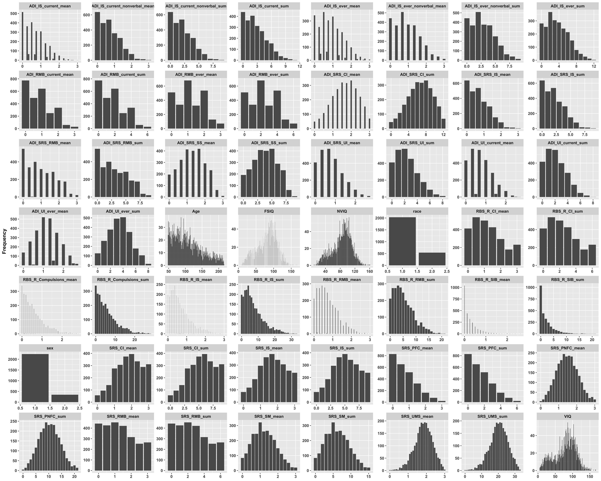
```

***

<br>


### Unaffected Siblings
```{r, generate_unaff_dist, eval=F, include=FALSE}
load("../outputs/all_phenotypes.Rdata")
phe_unaff <- na.omit(ds[[2]])
##cod_unaffe race anphe_unaff sex
phe_unaff[phe_unaff$value == "male",5] <- 1
phe_unaff[phe_unaff$value == "female",5] <- 2
phe_unaff$value <- as.numeric(phe_unaff$value)
phe_unaff$variable <- gsub("_Unaff_Sibs", "", phe_unaff$variable)

phe_dist_unaff <- ggplot(phe_unaff,aes(x = value)) + 
  facet_wrap(~variable,scales = "free") + 
  geom_bar() +
  theme(
    text = element_text(size=12, face="bold"),
    axis.title.x = element_blank()
  ) +
  ylab("Frequency") 
ggsave(file.path("figures/ssc_unaffSibs_phe.png"), phe_dist_unaff , height = 16, width = 20, dpi = 300)

```

```{r load_unaff_dist, warning=FALSE, out.width="100%", out.height="100%", dpi = 300}
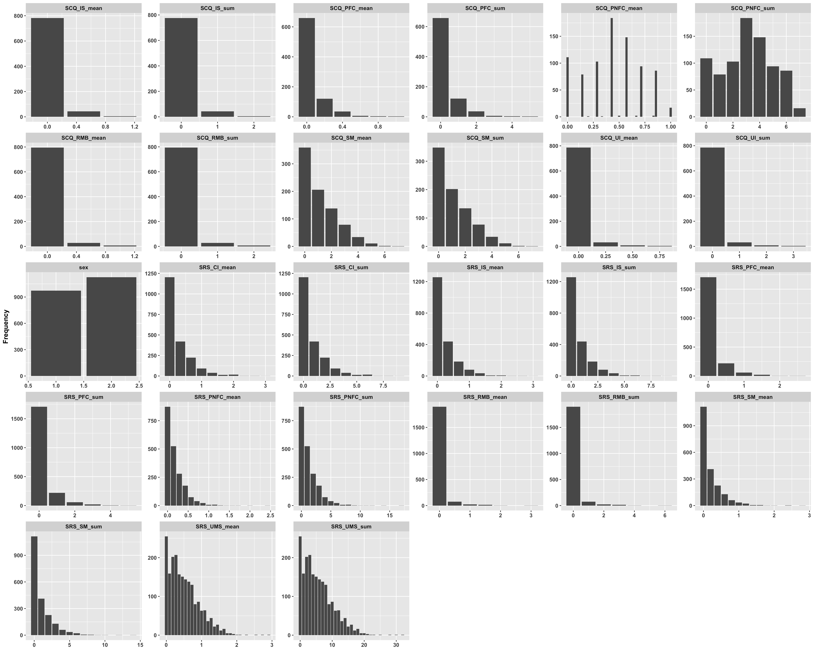
```

***

<br>


### Other Siblings

```{r, generate_other_dist, eval=F, include=FALSE}
load("../outputs/all_phenotypes.Rdata")
phe_oth <- na.omit(ds[[3]])
##code race and sex
phe_oth$value <- as.numeric(phe_oth$value)
phe_oth$variable <- gsub("_Other_Sibs", "", phe_oth$variable)

phe_dist_other <- ggplot(phe_oth,aes(x = value)) + 
  facet_wrap(~variable,scales = "free") + 
  geom_bar() +
  theme(
    text = element_text(size=5, face="bold"),
    axis.title.x = element_blank()
  ) +
  ylab("Frequency") 
ggsave(file.path("figures/ssc_otherSibs_phe.png"), phe_dist_other , height = 16, width = 20, dpi = 300)

```

```{r load_oth_dist, warning=FALSE, out.width="100%", out.height="100%", dpi = 300}
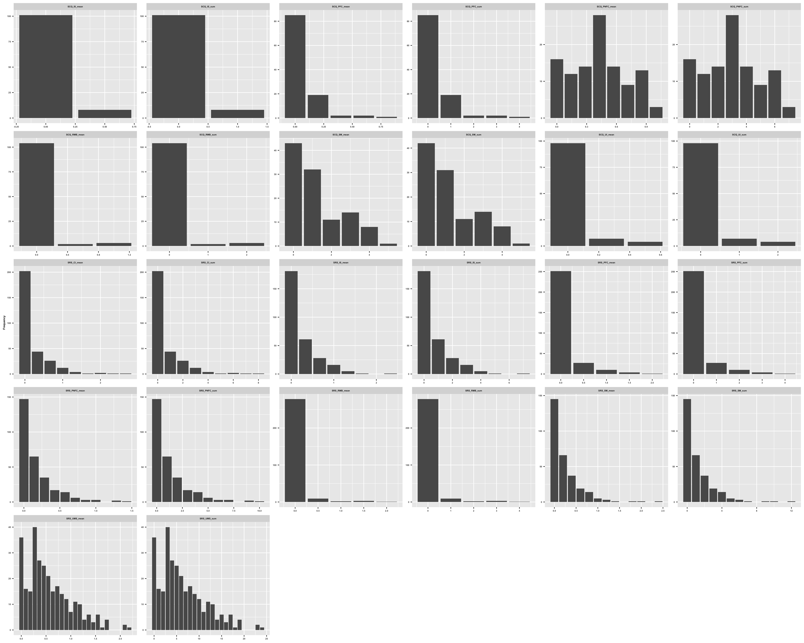
```


***

<br>

## Shared phenotypes {.tabset .tabset-fade .tabset-pills}
- Proband VS Unaffected Siblings: 15
- Proband VS Other Siblings: 14
- Unaffected Siblings VS Other Siblings: 26
- Proband VS Unaffected Siblings VS Other Siblings: 14

### Shared phenotype summary
```{r table_shared_phenotypes, warning=F}
mu <- mus[[1]]
mu2 <- mus[[2]]
mu3 <- mus[[3]]

mu$set <- "Proband"
mu2$set <- "Unaff_Sibs"
mu3$set <- "Other_Sibs"
mu$pheno <- gsub("_Proband", "", mu$Variable)
mu2$pheno <- gsub("_Unaff_Sibs", "", mu2$Variable)
mu3$pheno <- gsub("_Other_Sibs", "", mu3$Variable)
alls <- 
  mu[,c("Counts", "pheno")] %>% full_join(mu2[,c("Counts", "pheno")], by = "pheno") %>%
  full_join(mu3[,c("Counts", "pheno")], by = "pheno")  %>%
  select(pheno, everything())
names(alls) <- c("Variable", "Probands", "Unaffected Siblings", "Other Siblings")

datatable(alls, rownames = FALSE, filter="top", options = list(pageLength = 5, scrollX=T) )
```


***

<br>

### Shared phenotype distribution {.tabset .tabset-fade .tabset-pills}

#### Probands VS Unaffected Siblings
```{r generate_prob_unaff, warning=FALSE, eval=F, include=FALSE}
##probands common unaff_sibs
pro_vs_unaff <- na.omit(alls[,c(1:3)]) ##15
phe_pro$Group <- "Probands"
phe_unaff$Group <- "Unaffected Siblings"
phe_oth$Group <- "Other Siblings"
phe_pro_unaff <- rbind(phe_pro, phe_unaff)
phe_pro_unaff_com <- phe_pro_unaff[phe_pro_unaff$variable %in% pro_vs_unaff$Variable,]

pro_unaff_dist <- ggplot(phe_pro_unaff_com,aes(x = value, group = Group, color = Group, fill = Group, width = 0.8)) + 
  facet_wrap(~variable,scales = "free") + 
  geom_bar(position = position_dodge(),  alpha = 0.2) +
  theme_bw()+
  theme(
    text=element_text(size=12, face="bold"),
    plot.title = element_text(hjust = 0.5, face="bold",vjust = 1.2),
    legend.position = c(0.9,0.1),
    legend.text = element_text(size = 12),
    legend.key.height=unit(1.2,"line"),
    legend.key.width=unit(1.2,"line"),
    legend.background = element_blank(),
    legend.title = element_blank(),
    legend.key = element_blank(),
    axis.title.x = element_blank(),
    axis.ticks = element_line(size = 0.5),
    plot.margin = margin(1, 1, 1, 1, "cm")
  ) +
  ylab("Frequency")  
ggsave(file.path("figures/prob_VS_Unaff_sibs_dist.png"), pro_unaff_dist, height = 12, width = 16, dpi = 300)


```

```{r proband_VS_Unaff_sibs, out.width="100%", out.height="100%", warning=FALSE}
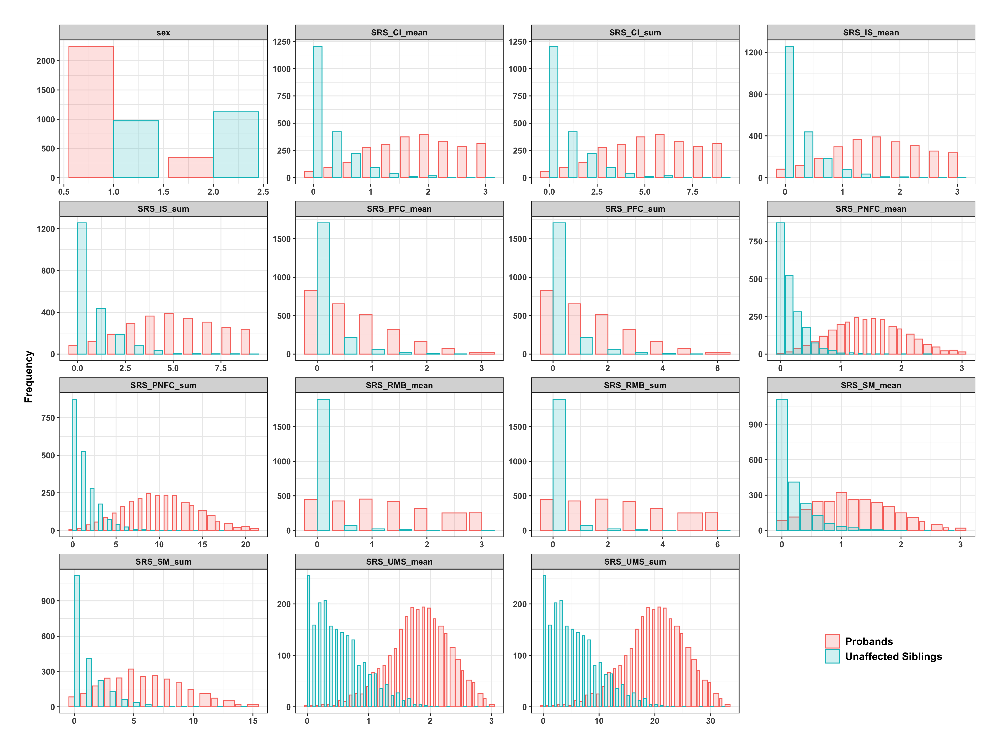
```
***

<br>

#### Probands VS Other Siblings
```{r out.width="100%", out.height="100%", warning=FALSE, eval=F, include=FALSE}
##probands common oth_sibs
pro_vs_oth <- na.omit(alls[,c(1:2,4)])  ##15
phe_pro$Group <- "Probands"
phe_oth$Group <- "othected Siblings"
phe_oth$Group <- "Other Siblings"
phe_pro_oth <- rbind(phe_pro, phe_oth)
phe_pro_oth_com <- phe_pro_oth[phe_pro_oth$variable %in% pro_vs_oth$Variable,]
phe_pro_oth_com$Group <- factor(phe_pro_oth_com$Group, levels = c("Probands", "Other Siblings"))

prob_oth_dist <- ggplot(phe_pro_oth_com,aes(x = value, group = Group, color = Group, fill = Group, width = 0.8)) + 
  facet_wrap(~variable,scales = "free") + 
  geom_bar(position = position_dodge(),  alpha = 0.2) +
  theme_bw()+
  theme(
    text=element_text(size=12, face="bold"),
    plot.title = element_text(hjust = 0.5, face="bold",vjust = 1.2),
    legend.position = c(0.9,0.1),
    legend.text = element_text(size = 12),
    legend.key.height=unit(1.2,"line"),
    legend.key.width=unit(1.2,"line"),
    legend.background = element_blank(),
    legend.title = element_blank(),
    legend.key = element_blank(),
    axis.title.x = element_blank(),
    axis.ticks = element_line(size = 0.5),
    plot.margin = margin(1, 1, 1, 1, "cm")
  ) +
  ylab("Frequency") 
ggsave(file.path("figures/prob_VS_Other_sibs_dist.png"), prob_oth_dist, height = 12, width = 16, dpi = 300)


```

```{r proband_VS_oth_sibs, out.width="100%", out.height="100%", warning=FALSE}
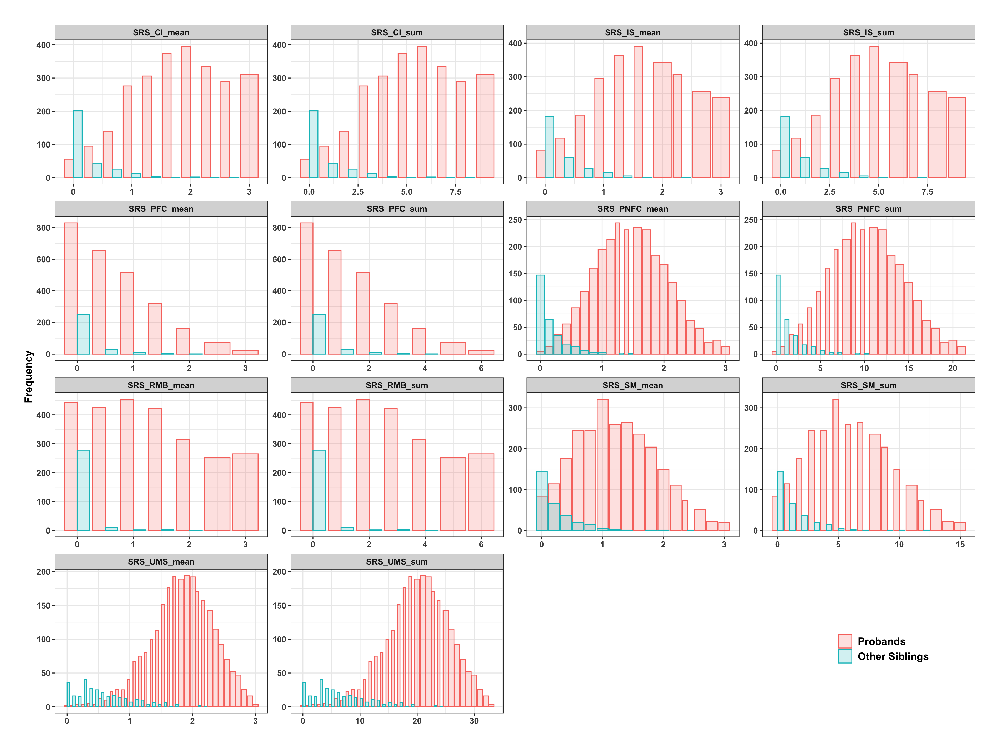
```

***

#### Probands VS Siblings
```{r out.width="100%", out.height="100%", warning=FALSE, eval=F, include=FALSE}
pro_vs_sibs <- na.omit(alls)  ## 14##15

phe_pro_sibs <- rbind(phe_pro, phe_unaff, phe_oth)
phe_pro_sibs_com <- phe_pro_sibs[phe_pro_sibs$variable %in% pro_vs_sibs$Variable,]
phe_pro_sibs_com$Group <- factor(phe_pro_sibs_com$Group, levels = c("Probands", "Unaffected Siblings", "Other Siblings"))
prob_sib_dist <- ggplot(phe_pro_sibs_com,aes(x = value, group = Group, color = Group, fill = Group, width = 0.8)) + 
  facet_wrap(~variable,scales = "free") + 
  geom_bar(position = position_dodge(),  alpha = 0.2) +
  theme_bw()+
  theme(
    text=element_text(size=10, face="bold"),
    plot.title = element_text(hjust = 0.5, face="bold",vjust = 1.2),
    legend.position = c(0.9,0.1),
    legend.text = element_text(size = 12),
    legend.key.height=unit(1.2,"line"),
    legend.key.width=unit(1.2,"line"),
    legend.background = element_blank(),
    legend.title = element_blank(),
    legend.key = element_blank(),
    axis.title.x = element_blank(),
    axis.ticks = element_line(size = 0.5),
    plot.margin = margin(1, 1, 1, 1, "cm")
  ) +
  ylab("Frequency") 
ggsave(file.path("figures/prob_VS_sibs_dist.png"), prob_sib_dist, height = 12, width = 16, dpi = 300)


```

```{r proband_VS_sibs, out.width="100%", out.height="100%", warning=FALSE}
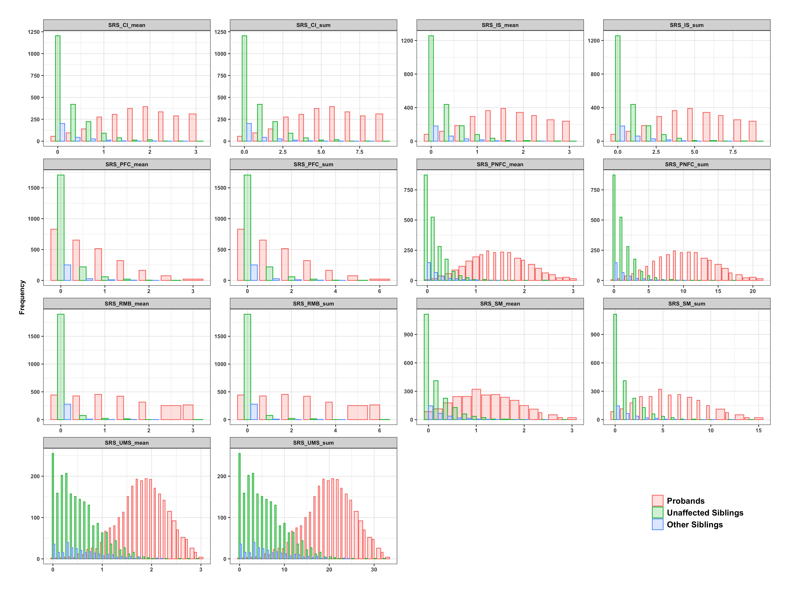
```

***

<br>

# Check sex information {.tabset .tabset-fade .tabset-pills}
- using plink \--check-sex option based on after-QC genotypes in impute_pipe
- genotype QC: \--geno 0.05 \--hwe 1e-6 \--mind 0.1 \--maf 0.01
- Note remove PAR regions (CHR 25 and .hh), only CHR 23 is used
- \>0.8 as male (coded as 1), < 0.2 as female (coded as 2)
- 11 PROBLEM individuals included in RRB phenotype files
  - 10 consistent with phenotype files of unaffected siblings
  - 1 with no sex information from other siblings (11712 4584699075_R01C02 2 0 PROBLEM 0.7319 UCSF_1Mv3 11712.s2)

```{r, eval=FALSE, include=FALSE}
setwd("/gpfs1/scratch/group30days/cnsg_park/uqywan/auti/SSC/microarray/QCd")
inputs <- c("UCSF_1Mv1/SSC_1Mv1_binary_allchrs_flip2", "UCSF_1Mv3/SSC_1Mv3_binary_allchrs_flip2", "UCSF_Omni2.5/SSC_Omni2.5_binary_allchrs_flip2_updateIDs")

res <- data.frame()
for(input in inputs){
  system(paste0("plink --bfile ", input, "_geno05_mind1_hwe1e6_maf01 --split-x b37 --make-bed --out ", input, "_checkSex1"))
  system(paste0("plink --bfile ", input, "_checkSex1 --chr 23 --set-hh-missing ", input, "_checkSex1.hh --make-bed --out ", input, "_checkSex2"))
  system(paste0("plink --bfile ", input, "_checkSex2 --check-sex --out ", input, "_checkSex3"))
  out <- read.table(paste0(input, "_checkSex3.sexcheck"), header = T, stringsAsFactors = F)
  out$chip <- strsplit(input, "/")[[1]][1]
  res <- rbind(res, out)
}
write.table(res, "sexcheck.txt", col.names = T, row.names = F, quote = F, sep = "\t")

```
***

<br>

## Mismatch summary
```{r}
sex <- read.table("../outputs/sexcheck.txt", header = T, stringsAsFactors = F)
res_sex1 <- sex[sex$chip == "UCSF_1Mv3",]
res_sex2 <- sex[sex$chip == "UCSF_1Mv1",]
res_sex3 <- sex[sex$chip == "UCSF_Omni2.5",]

fams <- read.table("../outputs/fams_covarites.txt", stringsAsFactors = F)
fam1 <- fams[fams$V7 == "1Mv3",]
fam2 <- fams[fams$V7 == "1Mv1",]
fam3 <- fams[fams$V7 == "Omni2.5",]


##confirm with other phenotype file 
pros <- sex[sex$STATUS == "PROBLEM",]
pros$RRB <- "NA"
pros[pros$IID %in% fams$V2,]$RRB <- fams[match(pros[pros$IID %in% fams$V2,]$IID, fams$V2), "V8"]

datatable(pros, rownames = FALSE, filter="top", caption = htmltools::tags$caption(
        style = 'caption-side: top; text-align: center; color:black; 
        font-size:200% ;',"Individuals with discordant sex information"), options = list(pageLength = 5, scrollX=T) )
```

***

<br><br>

## Chr-X F distributions {.tabset .tabset-fade .tabset-pills}
### Illumina 1Mv3 
***
<br>

- 31 PROBLEM
```{r, eval=F, include=FALSE}
sex_1mv3 <- ggplot(data = res_sex1, aes(x = factor(PEDSEX) , y = F, color = STATUS)) +
  geom_point() +
  theme_bw() +
  theme(
    text=element_text(size=12, face="bold"),
    # panel.grid.major = element_blank(),
    # panel.grid.minor = element_blank(),
    # panel.background = element_blank(),
    plot.title = element_text(hjust = 0.5, face="bold",vjust = 1.2),
    #legend.direction = "horizontal", 
    legend.position = c(0.2,0.35),
    legend.text = element_text(size = 16),
    legend.key.height=unit(1.2,"line"),
    legend.key.width=unit(1.2,"line"),
    legend.background = element_blank(),
    legend.title = element_blank(),
    #axis.line=element_blank(),
    legend.key = element_blank(),
    axis.title.x = element_blank(),
    axis.ticks = element_line(size = 0.5),
    plot.margin = margin(1, 1, 1, 1, "cm")
  ) +
  xlab ("Reported Sex (PEDSEX)") +
  ylab("ChrX heterozygosity (F)") +
  scale_y_continuous(expand = c(0,0), breaks = seq(0,1, 0.2)) +
  scale_x_discrete(labels = c("male", "female")) +
  geom_hline(yintercept = 0.8, color = "blue", linetype = "dashed") +
  geom_hline(yintercept = 0.2, color = "blue", linetype = "dashed") 
  # geom_text(aes(label=ifelse(SNPSEX!=0, NA, IID)), hjust = -0.05 )

ggsave(file.path("figures/sex_1mv3.png"), sex_1mv3, height = 6, width = 8, dpi = 300)
  
```

```{r sex-1mv3_dist, out.width="60%", out.height="80%", warning=FALSE}
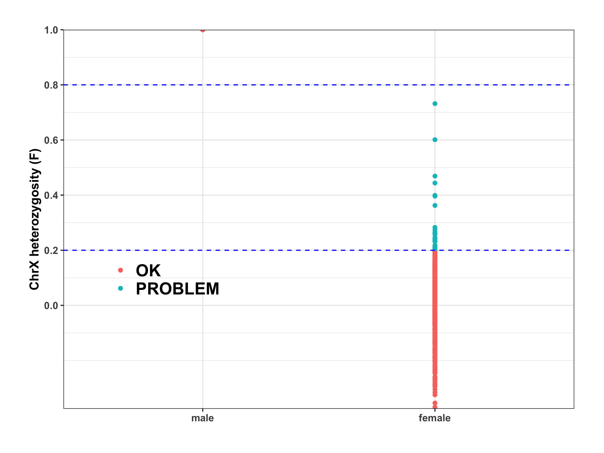
```

### Illumina 1Mv1 
***
<br>

- 12 PROBLEM

```{r, eval=F, include=FALSE}
res_sex2 <- res[res$chip == "UCSF_1Mv1",]

sex_1mv1 <- ggplot(data = res_sex2, aes(x = factor(PEDSEX) , y = F, color = STATUS)) +
  geom_point() +
  theme_bw() +
  theme(
    text=element_text(size=20, face="bold"),
    # panel.grid.major = element_blank(),
    # panel.grid.minor = element_blank(),
    # panel.background = element_blank(),
    plot.title = element_text(hjust = 0.5, face="bold",vjust = 1.2),
    #legend.direction = "horizontal", 
    legend.position = c(0.2,0.35),
    legend.text = element_text(size = 16),
    legend.key.height=unit(1.2,"line"),
    legend.key.width=unit(1.2,"line"),
    legend.background = element_blank(),
    legend.title = element_blank(),
    #axis.line=element_blank(),
    legend.key = element_blank(),
    axis.title.x = element_blank(),
    axis.ticks = element_line(size = 0.5),
    plot.margin = margin(1, 1, 1, 1, "cm")
  ) +
  xlab ("Reported Sex (PEDSEX)") +
  ylab("ChrX heterozygosity (F)") +
  scale_y_continuous(expand = c(0,0), breaks = seq(0,1, 0.2)) +
  scale_x_discrete(labels = c("male", "female")) +
  geom_hline(yintercept = 0.8, color = "blue", linetype = "dashed") +
  geom_hline(yintercept = 0.2, color = "blue", linetype = "dashed") #+
  #geom_text(aes(label=ifelse(SNPSEX!=0, NA, IID)), hjust = -0.05 )
 
ggsave(file.path("figures/sex_1mv1.png"), sex_1mv1, height = 6, width = 8, dpi = 300)
  
```

```{r sex-1mv1_dist, out.width="60%", out.height="80%", warning=FALSE}
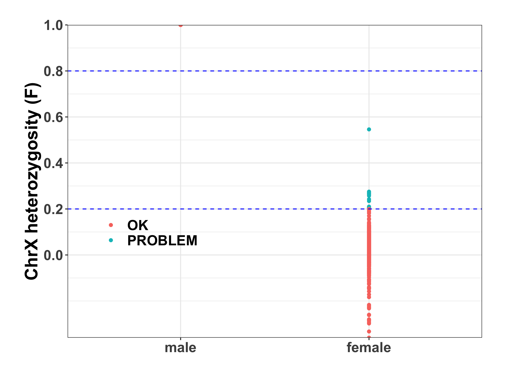
```

### Illumina Omni2.5M
***
<br>

- 9 PROBLEM

```{r, eval=F, include=FALSE}
res_sex3 <- res[res$chip == "UCSF_Omni2.5",]

sex_omni <- ggplot(data = res_sex3, aes(x = factor(PEDSEX) , y = F, color = STATUS)) +
  geom_point() +
  theme_bw() +
  theme(
    text=element_text(size=20, face="bold"),
    # panel.grid.major = element_blank(),
    # panel.grid.minor = element_blank(),
    # panel.background = element_blank(),
    plot.title = element_text(hjust = 0.5, face="bold",vjust = 1.2),
    #legend.direction = "horizontal", 
    legend.position = c(0.2,0.35),
    legend.text = element_text(size = 16),
    legend.key.height=unit(1.2,"line"),
    legend.key.width=unit(1.2,"line"),
    legend.background = element_blank(),
    legend.title = element_blank(),
    #axis.line=element_blank(),
    legend.key = element_blank(),
    axis.title.x = element_blank(),
    axis.ticks = element_line(size = 0.5),
    plot.margin = margin(1, 1, 1, 1, "cm")
  ) +
  xlab ("Reported Sex (PEDSEX)") +
  ylab("ChrX heterozygosity (F)") +
  scale_y_continuous(expand = c(0,0), breaks = seq(0,1, 0.2)) +
  scale_x_discrete(labels = c("male", "female")) +
  geom_hline(yintercept = 0.8, color = "blue", linetype = "dashed") +
  geom_hline(yintercept = 0.2, color = "blue", linetype = "dashed") #+
  #geom_text(aes(label=ifelse(SNPSEX!=0, NA, IID)), hjust = -0.05 )
 
ggsave(file.path("figures/sex_omni.png"), sex_omni, height = 6, width = 8, dpi = 300)
  
```

```{r sex-omni_dist, out.width="60%", out.height="80%", warning=FALSE}
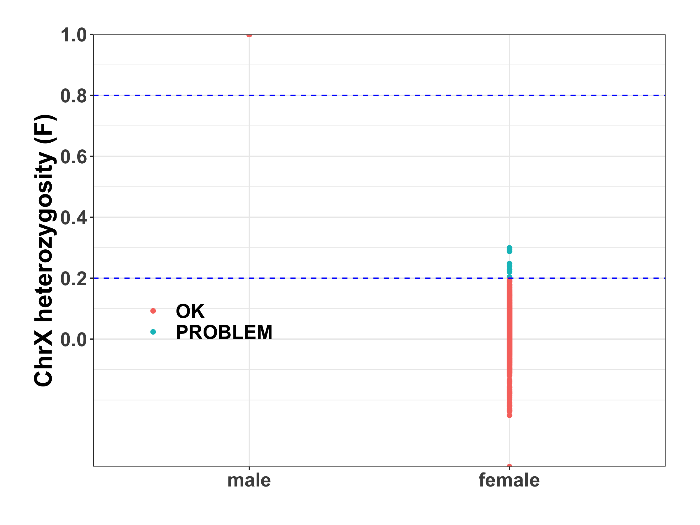
```

***

<br>


# Pairwise IBD estimation {.tabset .tabset-fade .tabset-pills}
- Using plink --genome rel-check based on genome-wide QCd genotypes 
- Genotype QC: --geno 0.05 --hwe 1e-6 --mind 0.1 --maf 0.01; further pruned on the SNPs \--indep-pairwise to prune in ~50K SNPs
- Only individuals within same family is checked
- Relationships (RT): OT (Parents), FS (Full Siblings), PO (Parent Offspring) 

```{r, eval=FALSE, include=FALSE}
setwd("/gpfs1/scratch/group30days/cnsg_park/uqywan/auti/SSC/microarray/QCd")
inputs <- c("UCSF_1Mv1/SSC_1Mv1_binary_allchrs_flip2", "UCSF_1Mv3/SSC_1Mv3_binary_allchrs_flip2", "UCSF_Omni2.5/SSC_Omni2.5_binary_allchrs_flip2_updateIDs")
r2s <- c(0.05, 0.05, 0.03)
res <- data.frame()
for(i in 1:length(inputs)){
  input <- inputs[i]
  r2 <- r2s[i]
  #system(paste0("plink --bfile ", input, "_geno05_mind1_hwe1e6_maf01 --set-hh-missing --make-bed --out ", input, "_geno05_mind1_hwe1e6_maf01_sethh"))
 # system(paste0("plink --bfile ", input, "_geno05_mind1_hwe1e6_maf01_sethh --exclude range high-LD-regions-hg19-GRCh37.txt --indep-pairwise 50 10 ", r2, " --out ", input, "_pruned"))
  #system(paste0("plink --bfile ", input, " --genome rel-check --out ", input, "_IBD"))
  system(paste0("plink --bfile ", input, "_geno05_mind1_hwe1e6_maf01_sethh  --extract ", input, "_pruned.prune.in --genome rel-check --out ", input, "_pruned_IBD"))
  out <- read.table(paste0(input, "_pruned_IBD.genome"), header  =T, stringsAsFactors = F)
  out$chip <- strsplit(input, "/")[[1]][1]
  res <- rbind(res, out)
}
#write.table(res, "IBD.txt", col.names = T, row.names = F, quote = F, sep = "\t")
write.table(res, "pruned_IBD.txt", col.names = T, row.names = F, quote = F, sep = "\t")

```

## Estimated pairwise IBD distributions  {.tabset .tabset-fade .tabset-pills}
### Illumina 1Mv3
```{r read_ibd}
gens <- read.table("../outputs/pruned_IBD.txt", header = T, stringsAsFactors = F)
gen_ibd1 <- gens[gens$chip == "UCSF_1Mv3",]
gen_ibd2 <- gens[gens$chip == "UCSF_1Mv1",]
gen_ibd3 <- gens[gens$chip == "UCSF_Omni2.5",]
```


```{r, eval=F, include=FALSE}
p_ibd1 <- ggplot(data = gen_ibd1, aes(x = PI_HAT, color = RT, fill = RT)) +
  geom_histogram(binwidth = 0.005) +
  facet_wrap(~RT,scales = "free") +
  theme_bw() +
  theme(
    text=element_text(size=12, face="bold"),
    # panel.grid.major = element_blank(),
    # panel.grid.minor = element_blank(),
    # panel.background = element_blank(),
    plot.title = element_text(hjust = 0.5, face="bold",vjust = 1.2),
    #legend.direction = "horizontal", 
    legend.position = "none",
    legend.text = element_text(size = 10),
    legend.key.height=unit(1.2,"line"),
    legend.key.width=unit(1.2,"line"),
    legend.background = element_blank(),
    legend.title = element_blank(),
    #axis.line=element_blank(),
    legend.key = element_blank(),
   # axis.title.x = element_blank(),
    axis.ticks = element_line(size = 0.5),
    plot.margin = margin(1, 1, 1, 1, "cm")
  ) +
  xlab ("Estimated pairwise IBD (PI_HAT)") +
  scale_x_continuous(breaks = seq(0, 1, 0.1))

ggsave(file.path("figures/ibd_1mv3.png"), p_ibd1, height = 5, width = 9, dpi = 300)

```

```{r ibd_1mv3, out.width="100%", out.height="100%", warning=F}
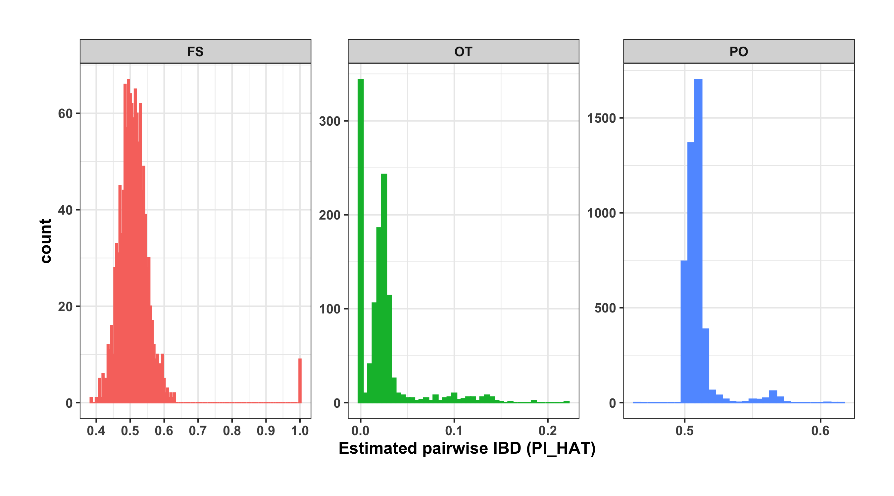
```


***

<br>

### Illumina 1Mv1
```{r, eval=F, include=FALSE}

p_ibd2 <- ggplot(data = gen_ibd2, aes(x = PI_HAT, color = RT, fill = RT)) +
  geom_histogram(binwidth = 0.005) +
  facet_wrap(~RT,scales = "free") +
  theme_bw() +
  theme(
    text=element_text(size=12, face="bold"),
    # panel.grid.major = element_blank(),
    # panel.grid.minor = element_blank(),
    # panel.background = element_blank(),
    plot.title = element_text(hjust = 0.5, face="bold",vjust = 1.2),
    #legend.direction = "horizontal", 
    legend.position = "none",
    legend.text = element_text(size = 12),
    legend.key.height=unit(1.2,"line"),
    legend.key.width=unit(1.2,"line"),
    legend.background = element_blank(),
    legend.title = element_blank(),
    #axis.line=element_blank(),
    legend.key = element_blank(),
  #  axis.title.x = element_blank(),
    axis.ticks = element_line(size = 0.5),
    plot.margin = margin(1, 1, 1, 1, "cm")
  ) +
  xlab ("Estimated pairwise IBD (PI_HAT)") +
  scale_x_continuous(breaks = seq(0, 1, 0.1))

ggsave(file.path("figures/ibd_1mv1.png"), p_ibd2, height = 5, width = 9, dpi = 300)

```

```{r ibd_1mv1, out.width="100%", out.height="100%", warning=F}
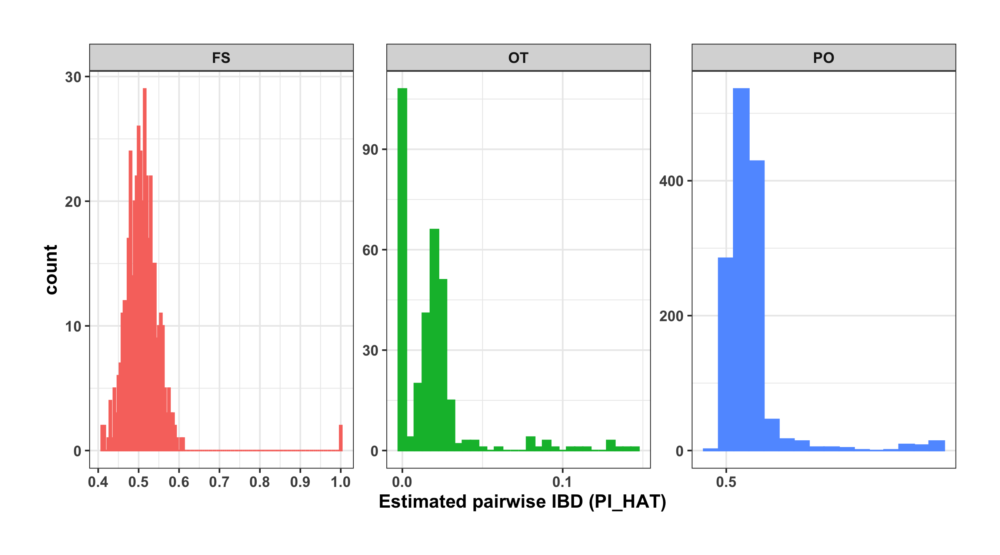
```


***

<br>

### Illumina Omni2.5
```{r, eval=F, include=FALSE}
p_ibd3 <- ggplot(data = gen_ibd3, aes(x = PI_HAT, color = RT, fill = RT)) +
  geom_histogram(binwidth = 0.005) +
  facet_wrap(~RT,scales = "free") +
  theme_bw() +
  theme(
    text=element_text(size=12, face="bold"),
    # panel.grid.major = element_blank(),
    # panel.grid.minor = element_blank(),
    # panel.background = element_blank(),
    plot.title = element_text(hjust = 0.5, face="bold",vjust = 1.2),
    #legend.direction = "horizontal", 
    legend.position = "none",
    legend.text = element_text(size = 12),
    legend.key.height=unit(1.2,"line"),
    legend.key.width=unit(1.2,"line"),
    legend.background = element_blank(),
    legend.title = element_blank(),
    #axis.line=element_blank(),
    legend.key = element_blank(),
  #  axis.title.x = element_blank(),
    axis.ticks = element_line(size = 0.5),
    plot.margin = margin(1, 1, 1, 1, "cm")
  ) +
  xlab ("Estimated pairwise IBD (PI_HAT)") +
  scale_x_continuous(breaks = seq(0, 1, 0.1))

ggsave(file.path("figures/ibd_omni.png"), p_ibd3, height = 5, width = 9, dpi = 300)

```

```{r ibd_omni, out.width="100%", out.height="100%", warning=F}
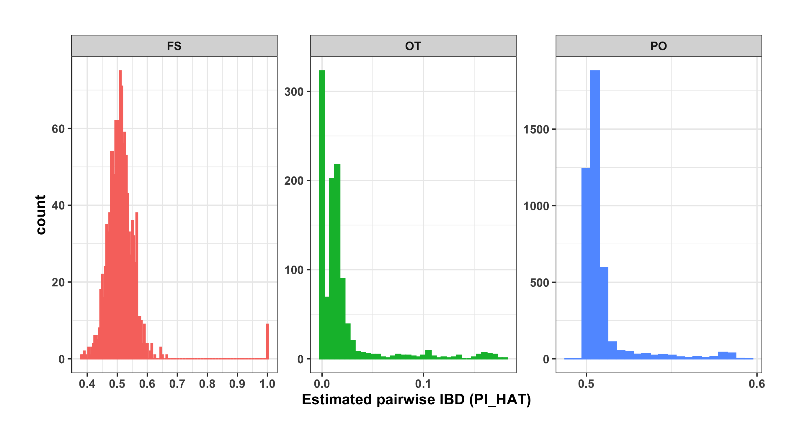
```

***

<br>

## Estimated pairwise IBD VS. Chr-X F {.tabset .tabset-fade .tabset-pills}
### Illumina 1Mv3

```{r p_ibd1_sex1_ot, eval=F, include=FALSE}
##OT_PI_HAT VS chrX-F
gen_ibd1_ot <- gen_ibd1[gen_ibd1$RT == "OT",]
gen_ibd1_ot$ot_ID1 <- paste0(gen_ibd1_ot$IID1, "_", gen_ibd1_ot$IID2)
gen_ibd1_ot$ot_ID2 <- paste0(gen_ibd1_ot$IID2, "_", gen_ibd1_ot$IID1)

fam_ot <- fam1[fam1$V3!=0 & fam1$V4 !=0,]
fam_ot$ot_ID1 <- paste0(fam_ot$V3, "_", fam_ot$V4)
fam_ot$ot_ID2 <- paste0(fam_ot$V4, "_", fam_ot$V3)

ibd1_fam1_ot <- merge(x = fam_ot, y = gen_ibd1_ot, by = c("ot_ID1", "ot_ID2"), all = T)
ibd1_fam1_ot <- ibd1_fam1_ot[!is.na(ibd1_fam1_ot$V3),]
ibd1_fam1_ot$F <- res_sex1[match(ibd1_fam1_ot$V2, res_sex1$IID),]$F
ibd1_fam1_ot$SNPSEX <- res_sex1[match(ibd1_fam1_ot$V2, res_sex1$IID),]$SNPSEX

p_ibd1_sex1_ot <- ggplot(data = ibd1_fam1_ot, aes(x = F, y = PI_HAT, group = V5, color = V5, fill = V5, shape = factor(SNPSEX) )) +
  geom_point(size = 1) +
 # facet_wrap(~V5,scales = "free") +
  theme_bw() +
  theme(
    text=element_text(size=10, face="bold"),
    # panel.grid.major = element_blank(),
    # panel.grid.minor = element_blank(),
    # panel.background = element_blank(),
    plot.title = element_text(hjust = 0.5, face="bold",vjust = 1.2, size = 8),
    #legend.direction = "horizontal", 
    legend.position = "none",
    legend.text = element_text(size = 12),
    legend.key.height=unit(1.2,"line"),
    legend.key.width=unit(1.2,"line"),
    legend.background = element_blank(),
    legend.title = element_blank(),
    #axis.line=element_blank(),
    legend.key = element_blank(),
   # axis.title.x = element_blank(),
    axis.ticks = element_line(size = 0.5),
    plot.margin = margin(1, 1, 1, 1, "cm")
  ) +
  ylab ("Estimated PI_HAT in parents") +
  xlab ("Chromosome X heterozygosity (F) in offspring") +
  geom_vline(xintercept=0.2, col="azure4", lty=2) +
  geom_vline(xintercept=0.8, col="azure4", lty=2) +
  geom_text_repel(aes(label=ifelse(SNPSEX != 0, NA, V2)), size = 3, hjust = 0 ) +
  ggtitle("Estimated IBD in parents (OT) VS. Chr-X heterozygosity across offsprings")
#ggplotly(p_ibd1_sex1_ot)
ggsave(file.path("figures/ibd_sexF_1mv3.png"), p_ibd1_sex1_ot, height = 4, width = 6, dpi = 300)
```

```{r plot_ibd_sexF_1mv3, warning=F, out.height="100%", out.width="100%"}
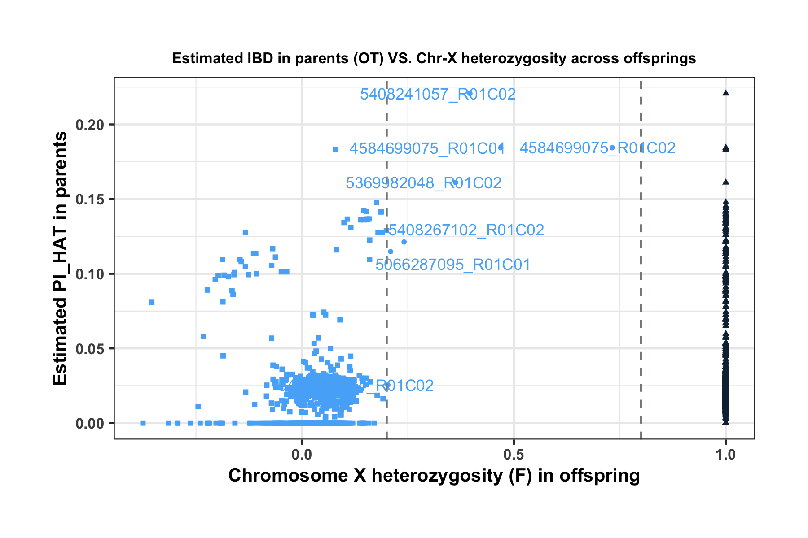
```

***

<br>

### Illumina 1Mv1

```{r p_ibd2_sex2_ot, eval=FALSE, include=FALSE}
##OT_PI_HAT VS chrX-F
gen_ibd2_ot <- gen_ibd2[gen_ibd2$RT == "OT",]
gen_ibd2_ot$ot_ID1 <- paste0(gen_ibd2_ot$IID1, "_", gen_ibd2_ot$IID2)
gen_ibd2_ot$ot_ID2 <- paste0(gen_ibd2_ot$IID2, "_", gen_ibd2_ot$IID1)

fam_ot <- fam2[fam2$V3!=0 & fam2$V4 !=0,]
fam_ot$ot_ID1 <- paste0(fam_ot$V3, "_", fam_ot$V4)
fam_ot$ot_ID2 <- paste0(fam_ot$V4, "_", fam_ot$V3)

ibd2_fam2_ot <- merge(x = fam_ot, y = gen_ibd2_ot, by = c("ot_ID1", "ot_ID2"), all = T)
ibd2_fam2_ot <- ibd2_fam2_ot[!is.na(ibd2_fam2_ot$V3),]
ibd2_fam2_ot$F <- res_sex2[match(ibd2_fam2_ot$V2, res_sex2$IID),]$F
ibd2_fam2_ot$SNPSEX <- res_sex2[match(ibd2_fam2_ot$V2, res_sex2$IID),]$SNPSEX

p_ibd2_sex2_ot <- ggplot(data = ibd2_fam2_ot, aes(x = F, y = PI_HAT, group = V5, color = V5, fill = V5, shape = factor(SNPSEX) )) +
  geom_point(size = 1) +
 # facet_wrap(~V5,scales = "free") +
  theme_bw() +
  theme(
    text=element_text(size=10, face="bold"),
    # panel.grid.major = element_blank(),
    # panel.grid.minor = element_blank(),
    # panel.background = element_blank(),
    plot.title = element_text(hjust = 0.5, face="bold",vjust = 1.2, size = 8),
    #legend.direction = "horizontal", 
    legend.position = "none",
    legend.text = element_text(size = 12),
    legend.key.height=unit(1.2,"line"),
    legend.key.width=unit(1.2,"line"),
    legend.background = element_blank(),
    legend.title = element_blank(),
    #axis.line=element_blank(),
    legend.key = element_blank(),
   # axis.title.x = element_blank(),
    axis.ticks = element_line(size = 0.5),
    plot.margin = margin(1, 1, 1, 1, "cm")
  ) +
  ylab ("Estimated PI_HAT in parents") +
  xlab ("Chromosome X heterozygosity (F) in offspring") +
  geom_vline(xintercept=0.2, col="azure4", lty=2) +
  geom_vline(xintercept=0.8, col="azure4", lty=2) +
  geom_text_repel(aes(label=ifelse(SNPSEX != 0, NA, V2)), size = 3, hjust = 0 ) +
  ggtitle("Estimated IBD in parents (OT) VS. Chr-X heterozygosity across offsprings")
#ggplotly(p_ibd2_sex2_ot)

ggsave(file.path("figures/ibd_sexF_1mv1.png"), p_ibd2_sex2_ot, height = 4, width = 6, dpi = 300)
```

```{r plot_ibd_sexF_1mv1, warning=F, out.height="100%", out.width="100%"}
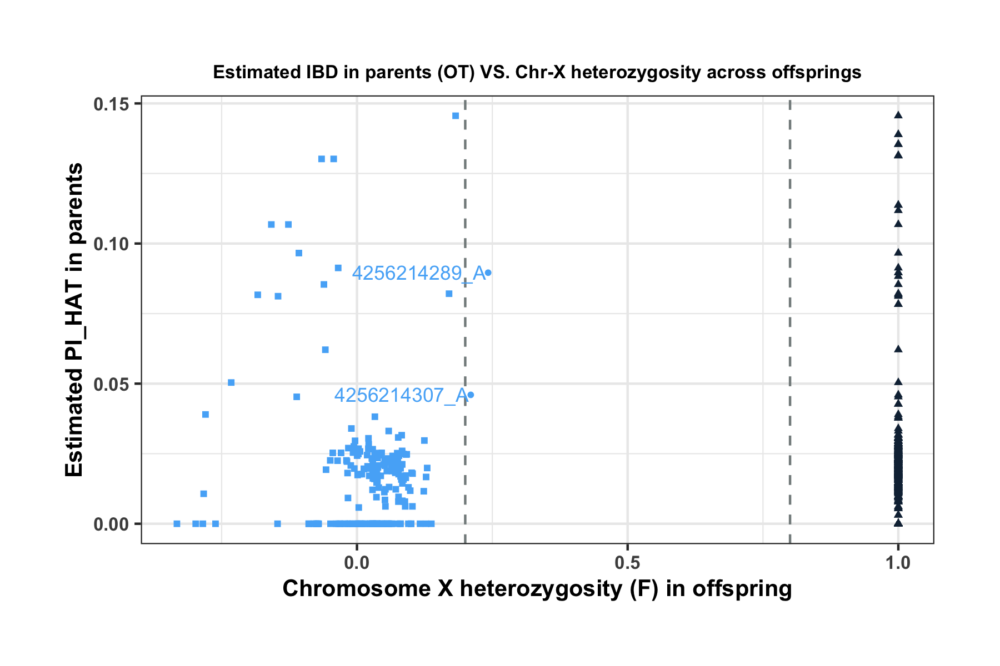
```

***

<br>

### Illumina Omni2.5
```{r p_ibd3_sex3_ot, eval=FALSE, include=FALSE}
##OT_PI_HAT VS chrX-F
gen_ibd3_ot <- gen_ibd3[gen_ibd3$RT == "OT",]
gen_ibd3_ot$ot_ID1 <- paste0(gen_ibd3_ot$IID1, "_", gen_ibd3_ot$IID2)
gen_ibd3_ot$ot_ID2 <- paste0(gen_ibd3_ot$IID2, "_", gen_ibd3_ot$IID1)

fam_ot <- fam3[fam3$V3!=0 & fam3$V4 !=0,]
fam_ot$ot_ID1 <- paste0(fam_ot$V3, "_", fam_ot$V4)
fam_ot$ot_ID2 <- paste0(fam_ot$V4, "_", fam_ot$V3)

ibd3_fam3_ot <- merge(x = fam_ot, y = gen_ibd3_ot, by = c("ot_ID1", "ot_ID2"), all = T)
ibd3_fam3_ot <- ibd3_fam3_ot[!is.na(ibd3_fam3_ot$V3),]
ibd3_fam3_ot$F <- res_sex3[match(ibd3_fam3_ot$V2, res_sex3$IID),]$F
ibd3_fam3_ot$SNPSEX <- res_sex3[match(ibd3_fam3_ot$V2, res_sex3$IID),]$SNPSEX

p_ibd3_sex3_ot <- ggplot(data = ibd3_fam3_ot, aes(x = F, y = PI_HAT, group = V5, color = V5, fill = V5, shape = factor(SNPSEX) )) +
  geom_point(size = 1) +
 # facet_wrap(~V5,scales = "free") +
  theme_bw() +
  theme(
    text=element_text(size=10, face="bold"),
    # panel.grid.major = element_blank(),
    # panel.grid.minor = element_blank(),
    # panel.background = element_blank(),
    plot.title = element_text(hjust = 0.5, face="bold",vjust = 1.2, size = 8),
    #legend.direction = "horizontal", 
    legend.position = "none",
    legend.text = element_text(size = 12),
    legend.key.height=unit(1.2,"line"),
    legend.key.width=unit(1.2,"line"),
    legend.background = element_blank(),
    legend.title = element_blank(),
    #axis.line=element_blank(),
    legend.key = element_blank(),
   # axis.title.x = element_blank(),
    axis.ticks = element_line(size = 0.5),
    plot.margin = margin(1, 1, 1, 1, "cm")
  ) +
  ylab ("Estimated PI_HAT in parents") +
  xlab ("Chromosome X heterozygosity (F) in offspring") +
  geom_vline(xintercept=0.2, col="azure4", lty=2) +
  geom_vline(xintercept=0.8, col="azure4", lty=2) +
  geom_text_repel(aes(label=ifelse(SNPSEX != 0, NA, V2)), size = 3, hjust = 0 ) +
  ggtitle("Estimated IBD in parents (OT) VS. Chr-X heterozygosity across offsprings")
#ggplotly(p_ibd3_sex3_ot)

ggsave(file.path("figures/ibd_sexF_omni.png"), p_ibd3_sex3_ot, height = 4, width = 6, dpi = 300)
```

```{r plot_ibd_sexF_omni, warning=F, out.height="100%", out.width="100%"}
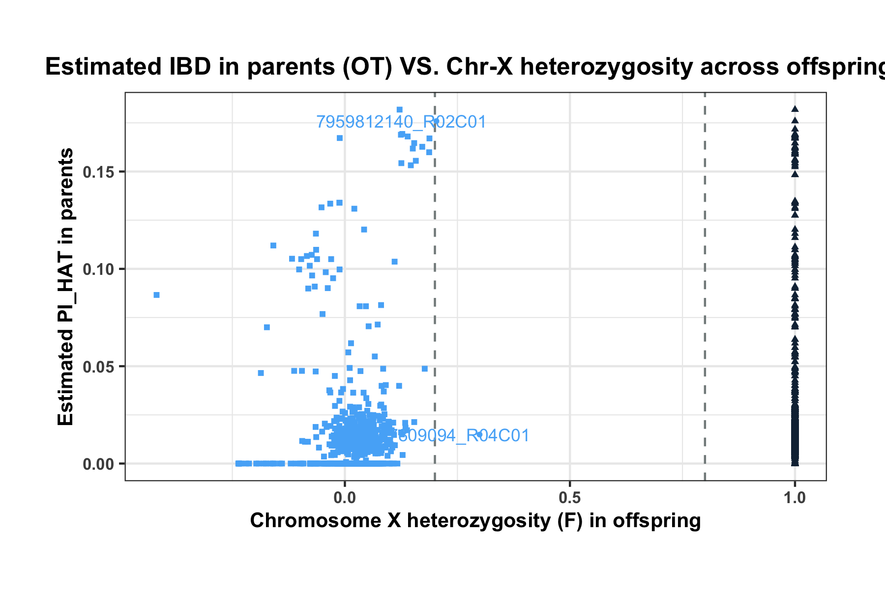
```

***

<br>

```{r, eval = FALSE, include=FALSE}
##First run using GRM 
# - construct grm based on QCd common SNPs
# - check the family.txt
# - parent-offspring & sibling pairs with GRM coefficient ranging from ~0.4 to ~1.4
setwd("/gpfs1/scratch/group30days/cnsg_park/uqywan/auti/SSC/microarray/QCd/")
chips <- c("UCSF_1Mv3/grm/SSC_1Mv3_binary", "UCSF_1Mv1/grm/SSSC_1Mv1_binary", "UCSF_Omni2.5/grm/SSSC_Omni2.5_binary")
chips1 <- c("UCSF_1Mv3/SSC_1Mv3_binary", "UCSF_1Mv1/SSSC_1Mv1_binary", "UCSF_Omni2.5/SSSC_Omni2.5_binary")
for(i in 1:3){
  chip <- chips[i]
  chip1 <- chips1[i]
  rel <- read.table(paste0(chip, "_qcd_autosome_qcd.family.txt"), stringsAsFactors = F)
  fam <- read.table(paste0(chip1, "_qcd_autosome.fam"), stringsAsFactors = F)
  
  ##check parent-offspring pairs
  rel$pair1 <- paste0(rel$V2, "_", rel$V4) 
  rel$pair2 <- paste0(rel$V4, "_", rel$V2)
  fam1 <- fam[fam$V3 !=0 | fam$V4 !=0,] ##2248
  fam2 <- melt(fam1, id = c("V1", "V2"))
  fam2$pair1 <- paste0(fam2$V2, "_", fam2$value)
  fam2$pair2 <- paste0(fam2$value, "_", fam2$V2)
  rel1 <- rel[rel$pair1 %in% fam2$pair1 | rel$pair1 %in%  fam2$pair2,] ##4496 pairs
  
  print(summary(rel1$V5))
  
  ##check siblings pairs
  fam3 <- fam1[duplicated(fam1$V1),]
  res <- data.frame()
  for(i in 1:nrow(fam3)){
    fid <- fam3[i,1]
    fam4 <- fam1[fam1$V1 == fid,]
    iid <- fam4$V2
    out <- data.frame(t(combn(iid, 2)))
    res <- rbind(res, out)
  }
  res$pair1 <- paste0(res$X1, "_", res$X2) 
  res$pair2 <- paste0(res$X2, "_", res$X1)
  
  rel2 <- rel[rel$pair1 %in% res$pair1 | rel$pair1 %in%  res$pair2,] ##1213 pairs
  print(summary(rel2$V5))
}
```

***

<br>

# Individual genome-wide heterozygosity {.tabset .tabset-fade .tabset-pills}
- Using \--het to calculate genome-wide (**using pruned SNPs**) heterozygosity 
- Mean heterozygosity = (N-O/N); Het_mean <- (N.NM. - O.HOM.)/N.NM.
- Using \--missing to calculate missing rates (individuals with missing rates > 0.1 will be removed)

```{r eval=FALSE, include=FALSE}
setwd("/gpfs1/scratch/group30days/cnsg_park/uqywan/auti/SSC/microarray/QCd")
inputs <- c("UCSF_1Mv1/SSC_1Mv1_binary", "UCSF_1Mv3/SSC_1Mv3_binary", "UCSF_Omni2.5/SSC_Omni2.5_binary")

res_het <- data.frame()
res_miss <- data.frame()
for(input in inputs){
  #heterozygosity
 # system(paste0("plink --bfile ", input, "_qcd_autosome --extract ", input, "_qcd_autosome_pruned.prune.in --het --out ", input, "_qcd_autosome_pruned_het"))
 # out <- read.table(paste0(input, "_qcd_autosome_pruned_het.het"), header  =T, stringsAsFactors = F)

  if(input == "UCSF_Omni2.5/SSC_Omni2.5_binary"){
      system(paste0("plink --bfile ", input, "_allchrs_flip2_updateIDs_geno05_mind1_hwe1e6_maf01_sethh --extract ", input, "_allchrs_flip2_updateIDs_pruned.prune.in --het --out ", input, "_allchrs_flip2_pruned_het"))

    #missing
   # system(paste0("plink --bfile ", input, "_allchrs_flip2_updateIDs --autosome --missing --out ", input, "_allchrs_flip2_missing"))
  } else{
  system(paste0("plink --bfile ", input, "_allchrs_flip2_geno05_mind1_hwe1e6_maf01_sethh --extract ", input, "_allchrs_flip2_pruned.prune.in --het --out ", input, "_allchrs_flip2_pruned_het"))
    ##missing
   # system(paste0("plink --bfile ", input, "_allchrs_flip2 --autosome --missing --out ", input, "_allchrs_flip2_missing"))
  }
  out <- read.table(paste0(input, "_allchrs_flip2_pruned_het.het"), header  =T, stringsAsFactors = F)
  out$chip <- strsplit(input, "/")[[1]][1]
  res_het <- rbind(res_het, out)
  
  # outs <- read.table(paste0(input, "_allchrs_flip2_missing.imiss"), header  =T, stringsAsFactors = F)
  # outs$chip <- strsplit(input, "/")[[1]][1]
  # res_miss <- rbind(res_miss, outs)
}
#write.table(res_het, "qcd_autosome_pruned_het.txt", col.names = T, row.names = F, quote = F, sep = "\t")
write.table(res_het, "allchrs_flip2_pruned_het.txt", col.names = T, row.names = F, quote = F, sep = "\t")
write.table(res_miss, "allchrs_flip2_imiss.txt", col.names = T, row.names = F, quote = F, sep = "\t")
```

***

## Genome-wide heterozygosity VS missing rates 

```{r check_miss_het, warning=FALSE, out.width="100%", out.height="80%"}
het <- read.table("../outputs/qcd_autosome_pruned_het.txt", header = T, stringsAsFactors = F)
het$Het_mean <- (het$N.NM. - het$O.HOM.)/het$N.NM.

imiss <- read.table("../outputs/allchrs_flip2_imiss.txt", header = T, stringsAsFactors = F)

het_imiss <- merge(imiss, het, by=c("FID", "IID", "chip"))
het_imiss[het_imiss$chip == "UCSF_1Mv1",1] <- "Illumina 1Mv1"
het_imiss[het_imiss$chip == "UCSF_1Mv3",1] <- "Illumina 1Mv3"
het_imiss[het_imiss$chip == "UCSF_Omni2.5",1] <- "Illumina Omni2.5M"
   
mu <- ddply(het_imiss, "chip", summarise, Het_mean=mean(Het_mean), F_mean=mean(F))
sds <-ddply(het_imiss, "chip", summarise, Het_sd=sd(Het_mean), F_sd=sd(F))
mus <- merge(mu, sds, by = "chip")

hetTh <- 3

fail_het <- het[het$F < (mean(het$F)  - hetTh*sd(het$F)) |
                        het$F > (mean(het$F) + hetTh*sd(het$F)),] #367 individuals for 3SD and 35 for 5 SD.

p_het <- ggplot() + geom_point(data=het_imiss, aes_string(x='F_MISS', y='Het_mean')) +
  xlab("Proportion of missing SNPs") +
  ylab("Mean heterozygosity") +
  theme_bw() + 
  theme(
    text = element_text(size=12, face="bold"),
    plot.title = element_text(color="black", size=14, hjust = 0.5,vjust = 1.2)
  ) +
  ggtitle("Genome-wide mean heterozygosity by Missingness across samples") +
  geom_hline(data = mus, aes(yintercept=Het_mean + 5 * Het_sd), lty=2,
             col="#e7298a") +
  geom_hline(data = mus, aes(yintercept=Het_mean - 5 * Het_sd), lty=2,
             col="#e7298a") +
  geom_hline(data = mus, aes(yintercept=Het_mean + 3 * Het_sd), lty=2,
             col="azure4") +
  geom_hline(data = mus, aes(yintercept=Het_mean - 3 * Het_sd), lty=2,
             col="azure4") +
  facet_wrap(~chip, nrow =1) +
  geom_vline(xintercept=0.1, col="azure4", lty=2)

p_F <- ggplot() + geom_point(data=het_imiss, aes_string(x='F_MISS', y='F')) +
  xlab("Proportion of missing SNPs") +
  ylab("Inbreeding Coefficient (F)") +
  theme_bw() + 
  theme(
    text = element_text(size=12, face="bold"),
    plot.title = element_text(color="black", size=14, hjust = 0.5,vjust = 1.2)
  ) +
  ggtitle("Inbreeding Coefficient (F) by Missingness across samples") +
  geom_hline(data = mus, aes(yintercept=F_mean + 5 * F_sd), lty=2,
             col="#e7298a") +
  geom_hline(data = mus, aes(yintercept=F_mean - 5 * F_sd), lty=2,
             col="#e7298a") +
  geom_hline(data = mus, aes(yintercept=F_mean + 3 * F_sd), lty=2,
             col="azure4") +
  geom_hline(data = mus, aes(yintercept=F_mean - 3 * F_sd), lty=2,
             col="azure4") +
  facet_wrap(~chip, nrow =1) +
  geom_vline(xintercept=0.1, col="azure4", lty=2)

# ggplotly(p_het)
# 
# ggplotly(p_F)    

ggsave(file.path("figures/p_het.png"), p_het, height = 4, width = 6, dpi = 300)
ggsave(file.path("figures/p_F.png"), p_F, height = 4, width = 6, dpi = 300)

```

```{r plot_het, out.height="40%", out.width="60%"}
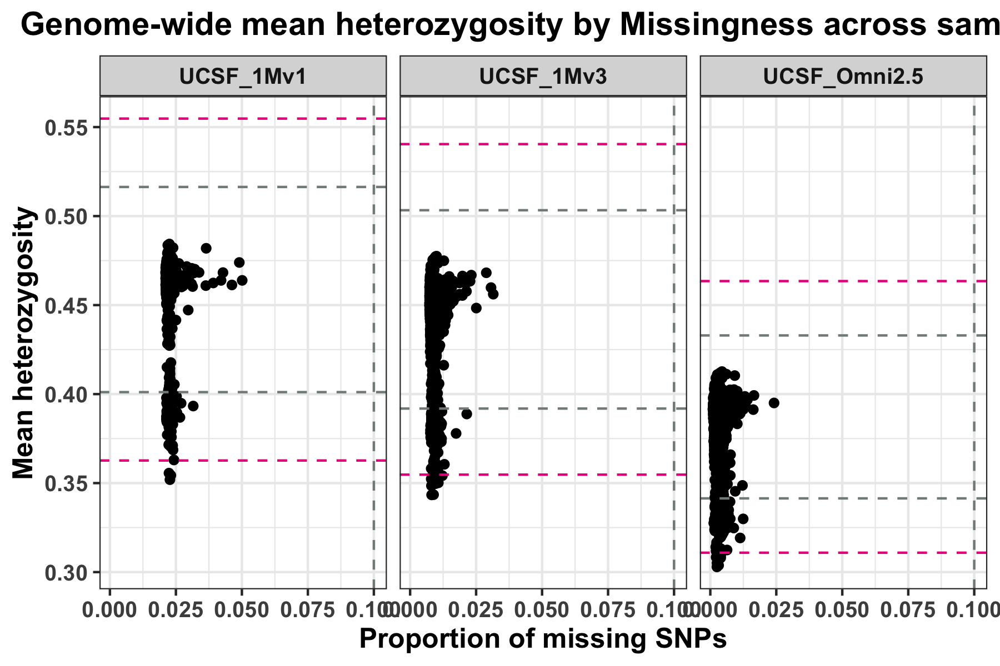
```

```{r plot_F, out.height="40%", out.width="60%"}
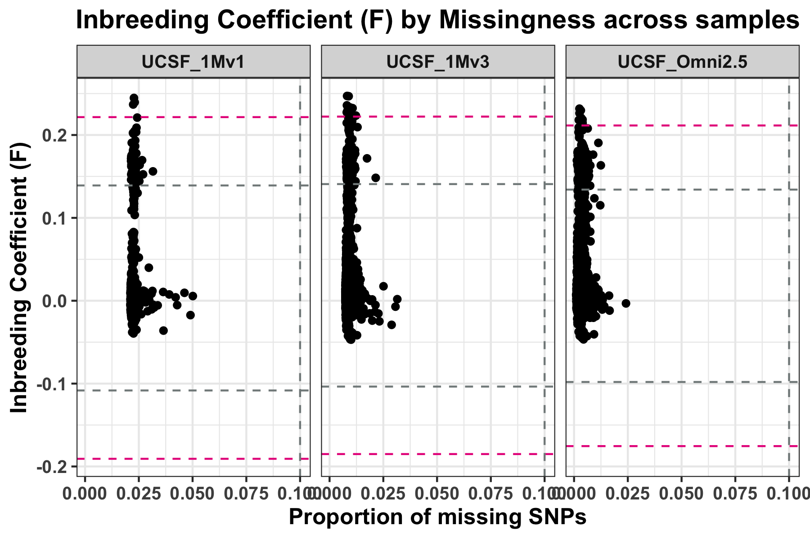
```

***

<br>

- Grey horizontal line is y = mean +/- 3SD
- Red horizontal line is y = mean +/- 5SD
- Grey vertical line is x = 0.1

***

<br>

## Genome-wide heterozygosity VS IBD estimation (PI_HAT)  {.tabset .tabset-fade .tabset-pills}

### Illumina 1Mv3
```{r p_ibd1_sex1_po, eval=FALSE, include=FALSE}
gen_ibd1_po <- gen_ibd1[gen_ibd1$RT == "PO",]
het1 <- het[het$chip == "UCSF_1Mv3",]

gen_ibd1_po$F_off <- het1[match(gen_ibd1_po$IID2, het1$IID),]$F
gen_ibd1_po$F_parent <- het1[match(gen_ibd1_po$IID1, het1$IID),]$F

#p_ibd1_sex1_ot <- 
p_het_ibd1_off <- ggplot(data = gen_ibd1_po, aes(x = F_off, y = PI_HAT)) +
  geom_point(size = 1) +
  # facet_wrap(~V5,scales = "free") +
  theme_bw() +
  theme(
    text=element_text(size=10, face="bold"),
    # panel.grid.major = element_blank(),
    # panel.grid.minor = element_blank(),
    # panel.background = element_blank(),
    plot.title = element_text(hjust = 0.5, face="bold",vjust = 1.2),
    #legend.direction = "horizontal", 
    legend.position = "none",
    legend.text = element_text(size = 12),
    legend.key.height=unit(1.2,"line"),
    legend.key.width=unit(1.2,"line"),
    legend.background = element_blank(),
    legend.title = element_blank(),
    #axis.line=element_blank(),
    legend.key = element_blank(),
    # axis.title.x = element_blank(),
    axis.ticks = element_line(size = 0.5),
    plot.margin = margin(1, 1, 1, 1, "cm")
  ) +
  ylab ("Estimated PI_HAT in PO pairs") +
  xlab ("Genome-wide heterozygosity (F) in offspring") +
  # geom_vline(xintercept=0.6, col="azure4", lty=2) +
  scale_y_continuous(breaks = seq(0.45, 0.65, 0.05)) 
# geom_vline(xintercept=0.8, col="azure4", lty=2) +
# geom_text_repel(aes(label=ifelse(SNPSEX != 0, NA, V2)), size = 3, hjust = 0 ) +
# ggtitle("Estimated IBD in PO VS. genome-wide F across offsprings")

p_het_ibd1_parent <- ggplot(data = gen_ibd1_po, aes(x = F_parent, y = PI_HAT)) +
  geom_point(size = 1) +
  # facet_wrap(~V5,scales = "free") +
  theme_bw() +
  theme(
    text=element_text(size=10, face="bold"),
    # panel.grid.major = element_blank(),
    # panel.grid.minor = element_blank(),
    # panel.background = element_blank(),
    plot.title = element_text(hjust = 0.5, face="bold",vjust = 1.2),
    #legend.direction = "horizontal", 
    legend.position = "none",
    legend.text = element_text(size = 12),
    legend.key.height=unit(1.2,"line"),
    legend.key.width=unit(1.2,"line"),
    legend.background = element_blank(),
    legend.title = element_blank(),
    #axis.line=element_blank(),
    legend.key = element_blank(),
    # axis.title.x = element_blank(),
    axis.ticks = element_line(size = 0.5),
    plot.margin = margin(1, 1, 1, 1, "cm")
  ) +
  ylab ("Estimated PI_HAT in PO pairs") +
  xlab ("Genome-wide heterozygosity (F) in parent") +
  # geom_vline(xintercept=0.6, col="azure4", lty=2) +
  scale_y_continuous(breaks = seq(0.45, 0.65, 0.05)) 
# geom_vline(xintercept=0.8, col="azure4", lty=2) +
# geom_text_repel(aes(label=ifelse(SNPSEX != 0, NA, V2)), size = 3, hjust = 0 ) +
#ggtitle("Estimated IBD in PO VS. genome-wide F across parents")

p_merge1 <- grid.arrange(p_het_ibd1_off, p_het_ibd1_parent, ncol=2,
             top=textGrob("Estimated IBD in PO VS. genome-wide F",
                          gp=gpar(fontsize=12,face="bold")))
ggsave(file.path("figures/p_het_ibd1.png"), p_merge1, height = 6, width = 8, dpi = 300)
```

```{r plot_het_ibd1, warning=F, out.height="80%", out.width="100%"}
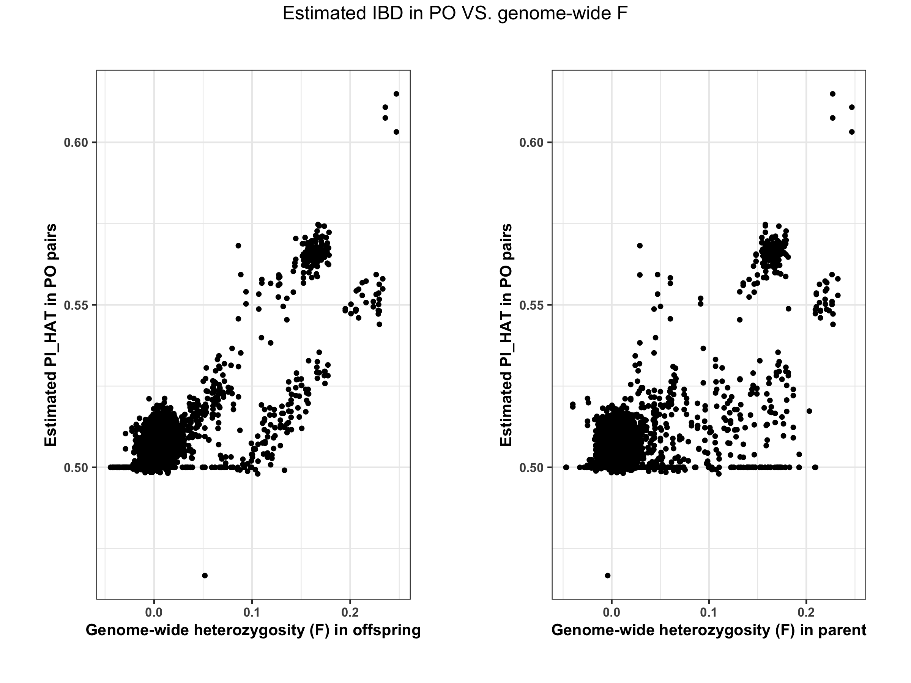
```

***
  
<br>

### Illumina 1Mv1
```{r p_ibd2_sex2_po, eval=FALSE, include=FALSE}
gen_ibd2_po <- gen_ibd2[gen_ibd2$RT == "PO",]
het2 <- het[het$chip == "UCSF_1Mv1",]

gen_ibd2_po$F_off <- het2[match(gen_ibd2_po$IID2, het2$IID),]$F
gen_ibd2_po$F_parent <- het2[match(gen_ibd2_po$IID1, het2$IID),]$F

#p_ibd2_sex2_ot <- 
p_het_ibd2_off <- ggplot(data = gen_ibd2_po, aes(x = F_off, y = PI_HAT)) +
  geom_point(size = 1) +
  # facet_wrap(~V5,scales = "free") +
  theme_bw() +
  theme(
    text=element_text(size=10, face="bold"),
    # panel.grid.major = element_blank(),
    # panel.grid.minor = element_blank(),
    # panel.background = element_blank(),
    plot.title = element_text(hjust = 0.5, face="bold",vjust = 1.2),
    #legend.direction = "horizontal", 
    legend.position = "none",
    legend.text = element_text(size = 12),
    legend.key.height=unit(1.2,"line"),
    legend.key.width=unit(1.2,"line"),
    legend.background = element_blank(),
    legend.title = element_blank(),
    #axis.line=element_blank(),
    legend.key = element_blank(),
    # axis.title.x = element_blank(),
    axis.ticks = element_line(size = 0.5),
    plot.margin = margin(1, 1, 1, 1, "cm")
  ) +
  ylab ("Estimated PI_HAT in PO pairs") +
  xlab ("Genome-wide heterozygosity (F) in offspring") +
  # geom_vline(xintercept=0.6, col="azure4", lty=2) +
  scale_y_continuous(breaks = seq(0.45, 0.65, 0.05)) 
# geom_vline(xintercept=0.8, col="azure4", lty=2) +
# geom_text_repel(aes(label=ifelse(SNPSEX != 0, NA, V2)), size = 3, hjust = 0 ) +
# ggtitle("Estimated IBD in PO VS. genome-wide F across offsprings")

p_het_ibd2_parent <- ggplot(data = gen_ibd2_po, aes(x = F_parent, y = PI_HAT)) +
  geom_point(size = 1) +
  # facet_wrap(~V5,scales = "free") +
  theme_bw() +
  theme(
    text=element_text(size=10, face="bold"),
    # panel.grid.major = element_blank(),
    # panel.grid.minor = element_blank(),
    # panel.background = element_blank(),
    plot.title = element_text(hjust = 0.5, face="bold",vjust = 1.2),
    #legend.direction = "horizontal", 
    legend.position = "none",
    legend.text = element_text(size = 12),
    legend.key.height=unit(1.2,"line"),
    legend.key.width=unit(1.2,"line"),
    legend.background = element_blank(),
    legend.title = element_blank(),
    #axis.line=element_blank(),
    legend.key = element_blank(),
    # axis.title.x = element_blank(),
    axis.ticks = element_line(size = 0.5),
    plot.margin = margin(1, 1, 1, 1, "cm")
  ) +
  ylab ("Estimated PI_HAT in PO pairs") +
  xlab ("Genome-wide heterozygosity (F) in parent") +
  # geom_vline(xintercept=0.6, col="azure4", lty=2) +
  scale_y_continuous(breaks = seq(0.45, 0.65, 0.05)) 
# geom_vline(xintercept=0.8, col="azure4", lty=2) +
# geom_text_repel(aes(label=ifelse(SNPSEX != 0, NA, V2)), size = 3, hjust = 0 ) +
#ggtitle("Estimated IBD in PO VS. genome-wide F across parents")

p_merge2 <- grid.arrange(p_het_ibd2_off, p_het_ibd2_parent, ncol=2,
             top=textGrob("Estimated IBD in PO VS. genome-wide F",
                          gp=gpar(fontsize=12,face="bold")))

ggsave(file.path("figures/p_het_ibd2.png"), p_merge2, height = 6, width = 8, dpi = 300)
```

```{r plot_het_ibd2, warning=F, out.height="80%", out.width="100%"}
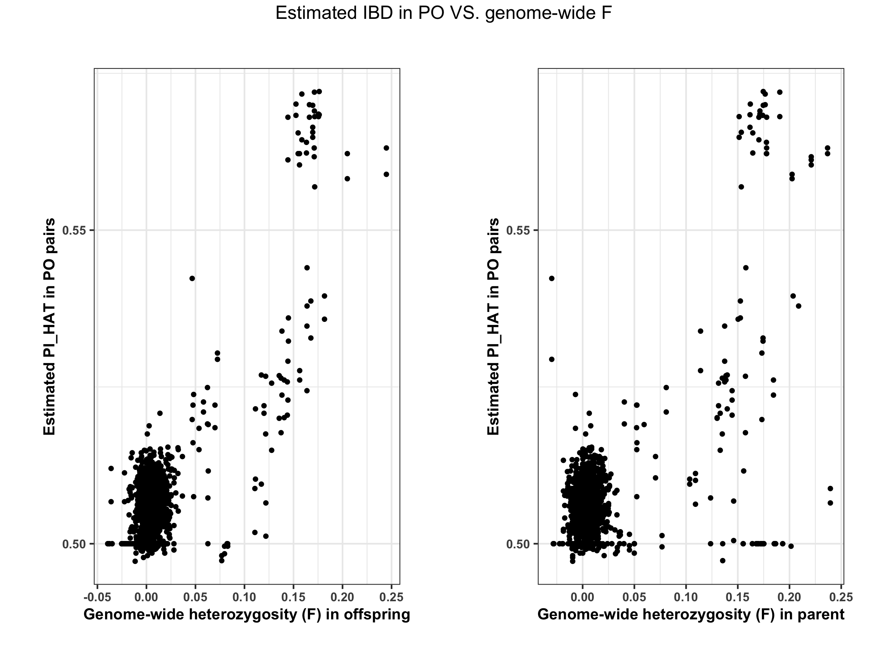
```

***
  
<br>

### Illumina Omni2.5
```{r p_ibd3_sex3_po, eval=FALSE, include=FALSE}
gen_ibd3_po <- gen_ibd3[gen_ibd3$RT == "PO",]
het3 <- het[het$chip == "UCSF_Omni2.5",]

gen_ibd3_po$F_off <- het3[match(gen_ibd3_po$IID2, het3$IID),]$F
gen_ibd3_po$F_parent <- het3[match(gen_ibd3_po$IID1, het3$IID),]$F

#p_ibd3_sex3_ot <- 
p_het_ibd3_off <- ggplot(data = gen_ibd3_po, aes(x = F_off, y = PI_HAT)) +
  geom_point(size = 1) +
  # facet_wrap(~V5,scales = "free") +
  theme_bw() +
  theme(
    text=element_text(size=10, face="bold"),
    # panel.grid.major = element_blank(),
    # panel.grid.minor = element_blank(),
    # panel.background = element_blank(),
    plot.title = element_text(hjust = 0.5, face="bold",vjust = 1.2),
    #legend.direction = "horizontal", 
    legend.position = "none",
    legend.text = element_text(size = 12),
    legend.key.height=unit(1.2,"line"),
    legend.key.width=unit(1.2,"line"),
    legend.background = element_blank(),
    legend.title = element_blank(),
    #axis.line=element_blank(),
    legend.key = element_blank(),
    # axis.title.x = element_blank(),
    axis.ticks = element_line(size = 0.5),
    plot.margin = margin(1, 1, 1, 1, "cm")
  ) +
  ylab ("Estimated PI_HAT in PO pairs") +
  xlab ("Genome-wide heterozygosity (F) in offspring") +
 # geom_vline(xintercept=0.6, col="azure4", lty=2) +
  scale_y_continuous(breaks = seq(0.45, 0.65, 0.05)) 
 # geom_vline(xintercept=0.8, col="azure4", lty=2) +
 # geom_text_repel(aes(label=ifelse(SNPSEX != 0, NA, V2)), size = 3, hjust = 0 ) +
 # ggtitle("Estimated IBD in PO VS. genome-wide F across offsprings")

p_het_ibd3_parent <- ggplot(data = gen_ibd3_po, aes(x = F_parent, y = PI_HAT)) +
  geom_point(size = 1) +
  # facet_wrap(~V5,scales = "free") +
  theme_bw() +
  theme(
    text=element_text(size=10, face="bold"),
    # panel.grid.major = element_blank(),
    # panel.grid.minor = element_blank(),
    # panel.background = element_blank(),
    plot.title = element_text(hjust = 0.5, face="bold",vjust = 1.2),
    #legend.direction = "horizontal", 
    legend.position = "none",
    legend.text = element_text(size = 12),
    legend.key.height=unit(1.2,"line"),
    legend.key.width=unit(1.2,"line"),
    legend.background = element_blank(),
    legend.title = element_blank(),
    #axis.line=element_blank(),
    legend.key = element_blank(),
    # axis.title.x = element_blank(),
    axis.ticks = element_line(size = 0.5),
    plot.margin = margin(1, 1, 1, 1, "cm")
  ) +
  ylab ("Estimated PI_HAT in PO pairs") +
  xlab ("Genome-wide heterozygosity (F) in parent") +
  # geom_vline(xintercept=0.6, col="azure4", lty=2) +
  scale_y_continuous(breaks = seq(0.45, 0.65, 0.05)) 
  # geom_vline(xintercept=0.8, col="azure4", lty=2) +
  # geom_text_repel(aes(label=ifelse(SNPSEX != 0, NA, V2)), size = 3, hjust = 0 ) +
  #ggtitle("Estimated IBD in PO VS. genome-wide F across parents")

p_merge3 <- grid.arrange(p_het_ibd3_off, p_het_ibd3_parent, ncol=2,
             top=textGrob("Estimated IBD in PO VS. genome-wide F",
                          gp=gpar(fontsize=12,face="bold")))

ggsave(file.path("figures/p_het_ibd3.png"), p_merge3, height = 6, width = 8, dpi = 300)

```

```{r plot_het_ibd3, warning=F, out.height="80%", out.width="100%"}
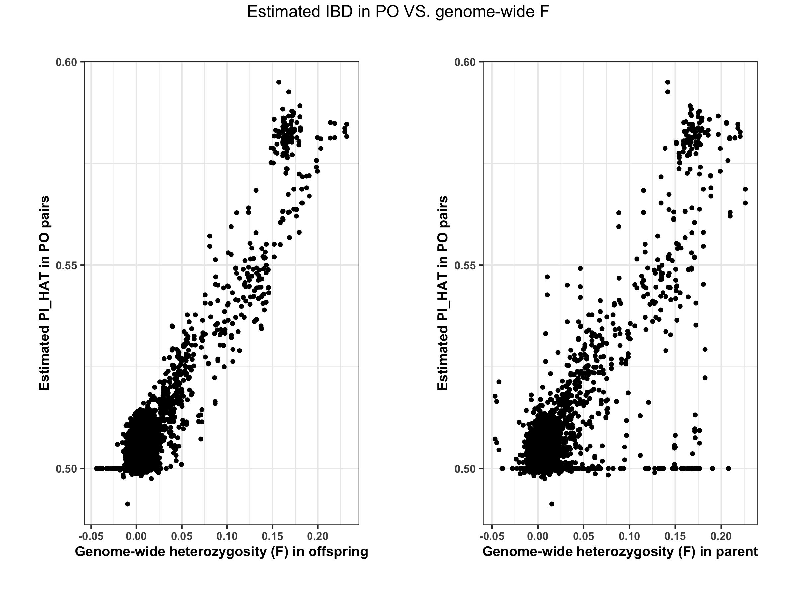
```

***

<br>

