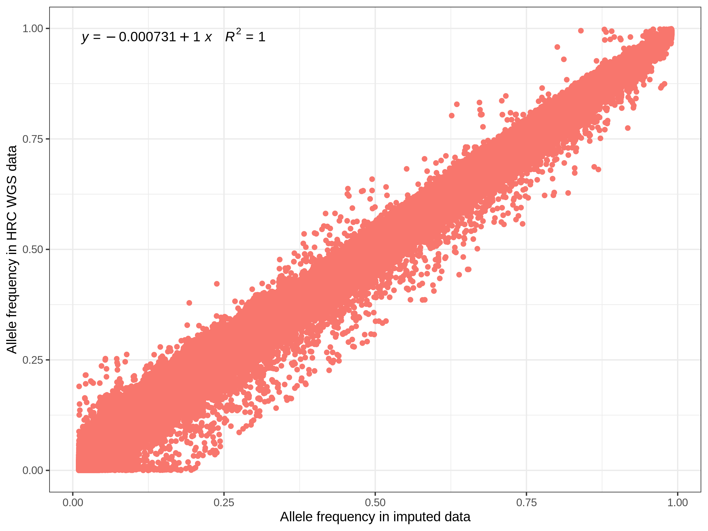
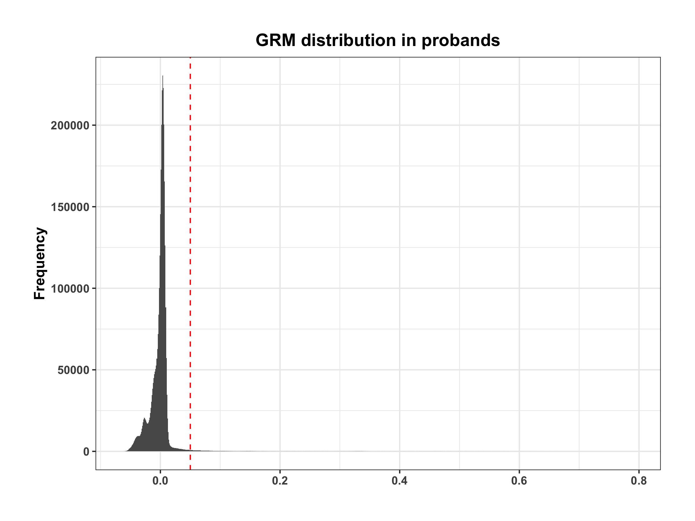

```{r setup, include=FALSE}

WD="~/OneDrive - The University of Queensland/mater_projs/auti_proj/AutismSpeaks_SSC/"
knitr::opts_chunk$set(echo = TRUE)
knitr::opts_chunk$set(warnings = FALSE)
knitr::opts_chunk$set(message  = FALSE)
#knitr::opts_chunk$set(eval = FALSE)
knitr::opts_knit$set(root.dir = WD)

library(reshape2)
library(ggplot2)
library(plyr)
library(knitr)
library(rmarkdown)
library(dplyr)
library(plyr)
library(plotly)
library(gapminder)
```

***

# Data structure
- Individuals from 2591 SSC families were genotyped on three chips. Note that members of each family were analyzed on the same array. 
  - Illumina 1Mv3 Duo (1189 families), 4626 people (2703 males, 1923 females), 1199033 SNPs
  - Illumina 1Mv1 (333 families), 1354 people (801 males, 553 females), 1072814 SNPs
  - Illumina HumanOmni2.5M (1069 families), 4240 people (2490 males, 1750 females), 2440283 SNPs
  - coded with ATGC, no need to recode
  - chromosome are from chr1 to chr26, of which autosome 1-22, X:23 & 25 will be imputed (** --output-chr M can recode as X instead of 23**)
  - **SNP IDs**: pay attention to Omini2.5, (--update-name from format as SNP(chr)-pos to kgp identifiers should be done first), later kgp identifiers should be converted to rsids.
  - All individuals are included for imputation
- Imputation will be done separately for each chip.

***

<br>


# Pre-imputation 

<br>

## Strand flip & liftover 
- From build 36 to build 37, from minus strand to plus strand)
- SSC was assembled based on build 36 (confirmed with [dbSNP](https://www.ncbi.nlm.nih.gov/snp/?cmd=search))
- [strand files](https://www.well.ox.ac.uk/~wrayner/strand/) 
  - Human1Mv1_C-b37.strand is used for both 1Mv1 and 1Mv3
  - HumanOmni2.5-8v1_A-b37.Source.strand is used for Omni2.5
- Check the output files from [update_build.sh](https://www.well.ox.ac.uk/~wrayner/strand/update_build.sh) 
  - remove chr 24
  - recode chr 23 to chr X
  - update-name for kgp identifiers in Omni2.5 (when there are a multitude of SNPs coded as kgp)
 
***

<br>

## Genotype QC {.tabset .tabset-fade .tabset-pills}

- Filters: \--geno 0.05 \--hwe 1e-6 \--mind 0.1 \--maf 0.01.
- Then recode to .vcf files (separate autosome and X-chromosome for now)

### Illumina 1Mv3
***
- 0 people removed due to missing genotype data (\--mind).
- Total genotyping rate is 0.990957.
- 15033 variants removed due to missing genotype data (\--geno).
- 126158 variants removed due to minor allele threshold(s).
- \--hwe: 38392 variants removed due to Hardy-Weinberg exact test.
- **859161 variants and 4626 people pass filters and QC.**

***

<br>

### Illumina 1Mv1
***
- 0 people removed due to missing genotype data (\--mind).
- Total genotyping rate is 0.976306.
- 29018 variants removed due to missing genotype data (\--geno).
- 136291 variants removed due to minor allele threshold(s).
- \--hwe: 6476 variants removed due to Hardy-Weinberg exact test.
- **898063 variants and 1354 people pass filters and QC.**

***

<br>

### Illumina Omni2.5M 
***
- 0 people removed due to missing genotype data (\--mind).
- Total genotyping rate is 0.99696.
- 7885 variants removed due to missing genotype data (\--geno).
- 723923 variants removed due to minor allele threshold(s). 
- \--hwe: 53449 variants removed due to Hardy-Weinberg exact test.
- **1575751 variants and 4240 people pass filters and QC.**


***

<br>

## Check and fix the REF allele 
- only for sanger imputation server
- using bcftools
- check with [HRC build37](ftp://ftp.1000genomes.ebi.ac.uk/vol1/ftp/technical/reference/human_g1k_v37.fasta.gz)

<style>
div.blue { background-color:#e6f0ff; border-radius: 5px; padding: 20px;}
</style>
<div class = "blue">
**The whole pre-Imputation QC process stored in /gpfs1/scratch/group30days/cnsg_park/uqywan/auti/scripts/ssc_preImp_QC.R**

</div>


***

<br>

## Submit for imputation
- [Sanger imputation server](https://imputation.sanger.ac.uk)
- Using Globus to transfer files (##sanger to ##flash)
- HRC reference  & Eagle v2.4 for phasing

***

<br>


# After Imputation
- recode .vcf to plink format
- extract info scores in .info
- fill missing SNP IDs in .bim/.info
- update .fam file in case there are two "_" in the FID_IID
- QC for each chip (filters: \--info 0.03)
  - 1Mv1: 29,613,517 SNPs left
  - 1Mv3: 31,605,064 SNPs left
  - Omni2.5: 30,466,266 SNPs left
  - 23,460,315 SNPs overlapped 
- merge .bfile of three chips 
  - remaining 22,274,458 SNPs after QC for \--geno 0.05 \--mac 1 \--hwe 1e-6
  - remaining 7,480,061 SNPs after QC for \--geno 0.05 \--maf 0.01 \--hwe 1e-6
  
***

<br>


## Frequency distrubtion
- overlapped SNPs between SSC_imputed and HRC (~7.2M SNPs with MAF > 0.01)
- based on same allele
- **0 SNPs with MAF difference > 0.2**
```{r check_frq, eval=FALSE, include=FALSE}
library(data.table)
library(seqinr)
setwd("/QRISdata/Q3457/SSC/hrc_imputed/QCd/")
frq.file <- "SSC_imputed_autosome_info.3_frq.frq"
ref.file <- "HRC.r1-1.GRCh37.wgs.mac5.sites.tab.gz"
raf.out <- "SSC_imputed_autosome_info.3_frqCheck"
raf = fread(frq.file, header=T)
HRC.raf = fread(ref.file, header=T, showProgress=F)
# N.B. HRC.raf$AF corresponds to non-reference allele!!!!!!

# Collate into one dataframe
raf$HRCPanelAF = HRC.raf[match(raf$SNP, HRC.raf$ID),]$AF
raf$HRCref = HRC.raf[match(raf$SNP, HRC.raf$ID),]$REF

# Remove 
# This is because there was an error for the following SNP on Sanger imputation:
# 1	rs13302914	0	868404	C	T
# - this SNP was not in HRC file
# - this position was also not in HRC file
# - however, on Sanger imputation, it found an allele mismatch which crashed
raf <- raf[which(!is.na(raf$HRCPanelAF)),]

# Find the alleles where REF/ALT are the wrong way around, and recalculate ALT_FREQS
print("Finding mis-matched reference alleles")
foo <- which(raf$A1 == raf$HRCref)
raf[foo,"MAF"] <- 1-raf[foo,"MAF"]
raf[foo,"A1"] <- raf[foo,"A2"]
raf[foo,"A2"] <- raf[foo,"HRCref"] # essentially, swapping columns around as ALT == HRCref

# Output file to force plink to recode
swap <- raf[foo,c("SNP", "A1")]

raf1 <- raf[which(((raf$MAF-raf$HRCPanelAF)^2 > 0.2^2)  |  (raf$A2!=raf$HRCref) ), ]
out <- raf1$SNP ##5860 SNPs

raf2 <- raf[!raf$SNP %in% out,] ##30248772 SNPs

qc_snps <- read.table("SSC_imputed_autosome_geno.05_maf.01_hwe1e-6_info.3.bim", stringsAsFactors = F)[,2] ##7480061
raf3 <- raf2[raf2$SNP %in% qc_snps,] ##7153695

write.table(out, file=paste(raf.out, ".freq02.outlier", sep = ""),
        quote=F, sep="\t", row.names=F, col.names=F)
#write.table(swap, file=paste(raf.out, ".freq2recode", sep = ""),
        quote=F, sep="\t", row.names=F, col.names=F)
write.table(raf, file=paste(raf.out, ".frq", sep = ""),
        quote=F, sep="\t", row.names=F, col.names=T)
write.table(raf2[,c(2, 5, 8)], file=paste(raf.out, "_removeOutlier.frq", sep = ""),
        quote=F, sep="\t", row.names=F, col.names=T) 
write.table(raf3[,c(2, 5, 8)], file=paste(raf.out, "_qcdSNPs.frq", sep = ""),
        quote=F, sep="\t", row.names=F, col.names=T) 

##plot
res <- raf3

res$Quality <- "Poor"
res[abs(res$MAF - res$HRCPanelAF) < 0.2,]$Quality <- "Good"
library(ggpmisc)
p <- ggplot(data = res, aes(x = MAF, y = HRCPanelAF)) +
  geom_smooth(method = "lm", se=TRUE, formula = y~x) +
  stat_poly_eq(formula = y~x, 
               aes(label = paste(..eq.label.., ..rr.label.., sep = "~~~")), 
               parse = TRUE,label.x.npc = "left", label.y.npc = "top",vjust=0.8) +         
  geom_point(aes(colour = Quality))+
  theme_bw()+
  labs(x="Allele frequency in imputed data",y="Allele frequency in HRC WGS data")+
  #ggtitle("Beta correlation between UKB2-GWS VS Test sets")+
  theme(
    plot.title = element_text(hjust = 0.5),
    legend.position="none"
  )
options(bitmapType='cairo')
ggsave(p, "/90days/uqywan67/autism_proj/SSC/figures/frqCheck.png", height = 6, width = 8, dpi = 300)
```


```{r plot_frq, echo=FALSE, out.width="80%", out.height="60%", message=FALSE}

```

***

<br>


## PCA {.tabset .tabset-fade .tabset-pills}
- Project the first 3 PCs based on pruned HapMap3 SNPs onto 1000G
- Using K-means to calculate distance
- Assign ancestry based on posterior probability 0.9

### All individuals
```{r pca_all, out.width="80%", out.height="60%"}
toAssign <- read.table("../outputs/ssc_anc.txt", header = T, stringsAsFactors = F)

#pca_all <- 
ggplot(data = toAssign, aes(x = PC1, y = PC2, color = Assigned, shape = Group)) +
  geom_point() +
  ylab("PC2") +
  xlab("PC1")
```

***

<br>

### Probands only {.tabset .tabset-fade .tabset-pills}

#### Self Reported VS Ancestry Assigned 
```{r}
toAssign1 <- read.table("../outputs/proband_anc.txt", header = T, stringsAsFactors = F)
kable(table(toAssign1$Self_Reported, toAssign1$Assigned))
```

***

<br>


#### PCA plot based on assigned ancestry
```{r pca_prob, out.width="80%", out.height="60%"}
#pca_prob <- 
ggplot(data = toAssign1, aes(x = PC1, y = PC2, color = Assigned)) +
  geom_point() +
  ylab("PC2") +
  xlab("PC1")
```

***

<br>


## Relatedness in Probands
- Generate GRM based on LD pruned SNPs
- 2206 probands with pairwise GRM < 0.05
```{r read_grm, eval=FALSE, include=FALSE}
setwd("~/autism_proj/SSC/grm")
ReadGRMBin=function(prefix, AllN=F, size=4){
  sum_i=function(i){
    return(sum(1:i))
  }
  BinFileName=paste(prefix,".grm.bin",sep="")
  NFileName=paste(prefix,".grm.N.bin",sep="")
  IDFileName=paste(prefix,".grm.id",sep="")
  id = read.table(IDFileName)
  n=dim(id)[1]
  BinFile=file(BinFileName, "rb");
  grm=readBin(BinFile, n=n*(n+1)/2, what=numeric(0), size=size)
  NFile=file(NFileName, "rb");
  if(AllN==T){
    N=readBin(NFile, n=n*(n+1)/2, what=numeric(0), size=size)
  }
  else N=readBin(NFile, n=1, what=numeric(0), size=size)
  i=sapply(1:n, sum_i)
  return(list(diag=grm[i], off=grm[-i], id=id, N=N))
}

##LD prune 0.3
grm_03 <- data.frame(ReadGRMBin("SSC_pruned.3_probands")$off)
names(grm_03) <- "off"

ggplot(data = grm_03) + 
  geom_histogram(aes(x = off), binwidth = 0.001) +
  ylab("Frequency") +
  xlab("Relatedness based on GRM") +
  theme_bw()+
  theme(
    text=element_text(size=12, face="bold"),
    plot.title = element_text(hjust = 0.5, face="bold",vjust = 1.2),
    legend.position = c(0.9,0.1),
    legend.text = element_text(size = 12),
    legend.key.height=unit(1.2,"line"),
    legend.key.width=unit(1.2,"line"),
    legend.background = element_blank(),
    legend.title = element_blank(),
    legend.key = element_blank(),
    axis.title.x = element_blank(),
    axis.ticks = element_line(size = 0.5),
    plot.margin = margin(1, 1, 1, 1, "cm")
  ) +
  geom_vline(xintercept = 0.05, linetype ="dashed", color = "red") +
  ggtitle("GRM distribution in probands")
ggsave("../figures/SSC_proband_prune.3.png", height = 6, width = 8, dpi = 300)


##LD prune 0.9
grm_09 <- data.frame(ReadGRMBin("SSC_pruned.9_probands")$off)
names(grm_09) <- "off"

ggplot(data = grm_09) + 
  geom_histogram(aes(x = off), binwidth = 0.001) +
  ylab("Frequency") +
  xlab("Relatedness based on GRM") +
  theme_bw()+
  theme(
    text=element_text(size=12, face="bold"),
    plot.title = element_text(hjust = 0.5, face="bold",vjust = 1.2),
    legend.position = c(0.9,0.1),
    legend.text = element_text(size = 12),
    legend.key.height=unit(1.2,"line"),
    legend.key.width=unit(1.2,"line"),
    legend.background = element_blank(),
    legend.title = element_blank(),
    legend.key = element_blank(),
    axis.title.x = element_blank(),
    axis.ticks = element_line(size = 0.5),
    plot.margin = margin(1, 1, 1, 1, "cm")
  ) +
  geom_vline(xintercept = 0.05, linetype ="dashed", color = "red") +
  ggtitle("GRM distribution in probands")
ggsave("../figures/SSC_proband_prune.9.png", height = 6, width = 8, dpi = 300)

```

```{r plot_grm, echo=FALSE, out.width="80%", out.height="60%", message=FALSE}

```

***

<style>
div.blue { background-color:#e6f0ff; border-radius: 5px; padding: 20px;}
</style>
<div class = "blue">
**The whole process stored in /gpfs1/scratch/group30days/cnsg_park/uqywan/auti/scripts/afterImp_QC*.R**

</div>

***

<br>


